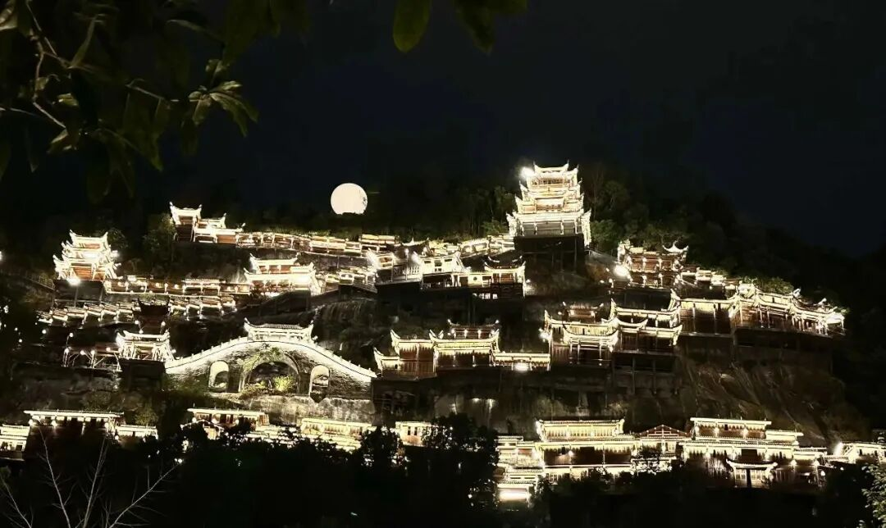

**“三乘聖道有伏滅義，真無我解違我執故。”** 这个三乘圣道：声闻、缘觉、大乘的圣道，这个圣道要么是直接断烦恼，要么直接缘空性。“三乘圣道”当中“有伏灭义”，他依出世间道，可以让第七识不现起。“真无我解违我执故”，我执是什么呢？我执是缘第八识为我；而我执的对手，三乘的圣道，则是出世道，他是缘真如，是“无我”，这个“真无我智”直接缘真如的时候，他是见空性，空掉，空掉什么呢？唯识来说最简单无我，就是“能取所取异体空”，或者说“三性三无性”，他要灭掉的就是遍计所执性，灭掉我们错误的认识，把错误的认识要排除掉——这是简单来说，复杂来说就不是这样了。

所以真正的无我的认知是和我执相违背的，所以三乘圣道起的时候第七识是不现起的。这一段是在解释这一句，（學位“滅定”“出世道”中，俱暫伏滅，故說“無有”），或者说是为他找理由——为什么它说没有。

**“後得無漏現在前時，是彼等流，亦違此意，真無我解及後所得俱無漏故，名出世道。”

在出圣根本定以后，前面讲的三乘圣道是出世道，那么在入无漏定以后，在修道位直接缘真如的时候，那么出了这个根本无分别定，他的无漏位现在起的时候，“是彼等流”。

这里的“彼”是什么？这个“彼”是三乘圣道，“** 後得無漏**”是三乘的圣道的等流，彼是圣根本无分别定、是三乘圣道。那么出世的圣根本无分别定的出定以后，此后得无漏是圣根本无分别定的等流。

“亦违此意”，这句话主语还是“** 後得無漏**”——后得无漏现在前的时候，也是和这个此意（不是单纯的第七识了，是此染污意），也“违”背这个染污意。意思是说，后得无漏位的时候，这个染污意也不现前。

一个是根本无分别的心，一个是彼等流的后得无漏智。出了圣根本定以后，圣根本定的等流，平等流出的，就跟他差不多，或者跟他一样的，“差不多”这个词还不够，跟他同类的……“这个”智慧现在前的时候，也是出世道。这里面要讲什么呢？就是三乘圣道当中，三乘的这个修道当中，此二现在前的时候，这个时候第七识是暂伏灭的。

