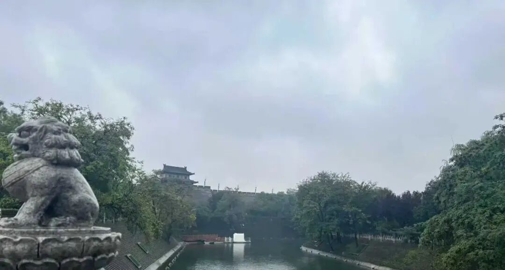

**“‘滅定’既是聖道等流，極寂靜故，此亦非有。”

这个灭尽定，大家知道是跟圣道有关的，我们前面讲他见真如以后才有的是吧。

“等流”，我们讲过很多了，“等”是平等，“流”是流出，比如前面你是贪吃苹果的心，后面还是贪痴苹果的心，这个叫“等流”。

“此亦非有”，这个“此”是指的染污意。

灭尽定因为是圣道等流的缘故，超出三界，身心极为寂静，所以，灭尽定是也没有染污意。

** “由未永斷此種子故，從滅盡定、聖道起已，此復現行，乃至未滅。”

那么由于这个“灭尽定”和这个“三乘圣道”的他这个时候（修道位中）他是单纯有“伏灭”的意思，他没有断他的种子，只是断他（染污意）的现行。所以当从灭尽定起的时候，或者从圣道起的时候，或者你后得有漏现在起的时候，那这个（“此”是）染污意、染末那，现行又重新的表现出来。

“乃至未灭”，这个“乃至未灭”是什么，乃至没有证三乘的阿罗汉的时候，这个染末那识是可以现行的。你看我加个“可以”，永远现行是不可以，这个可以是“堪”，堪能。

因为在修道位，没有永断此染污意的种子，那么，当从灭尽定出定，或者从圣根本定出定以后，只要此染污意未究竟灭、未到三乘阿罗汉位，则此染污意必然重新显现。

这里面怎么重新显现呢，从阿赖耶识里的种子显现……一般是前之第七识相续引发后之第七识（这里不用“刹那”二字，有深意，不展开了）……这个也比较复杂，这里也不展开了。

**“然此染意相應煩惱是俱生故，非見所斷；是染污故，非非所斷；”

此“染污意”的他的烦恼是俱生的还是分别的呢？是俱生烦恼，所以“非见所断”，因为“见所断”断的是“分别烦”恼——见道位所断的叫“见所断”，见道所断就是分别烦恼，又叫遍计烦恼。

这两句话加起来，“然此染污意相应”的“烦恼”是（两个“非”就是“是”）“修所断”。他不是“非所断”，也不是“见所断”，那他就是“修所断”的！比如说菩提心，肯定不是“见所断”，菩提心也不是“修所断”，所以菩提心是“非所断”。

