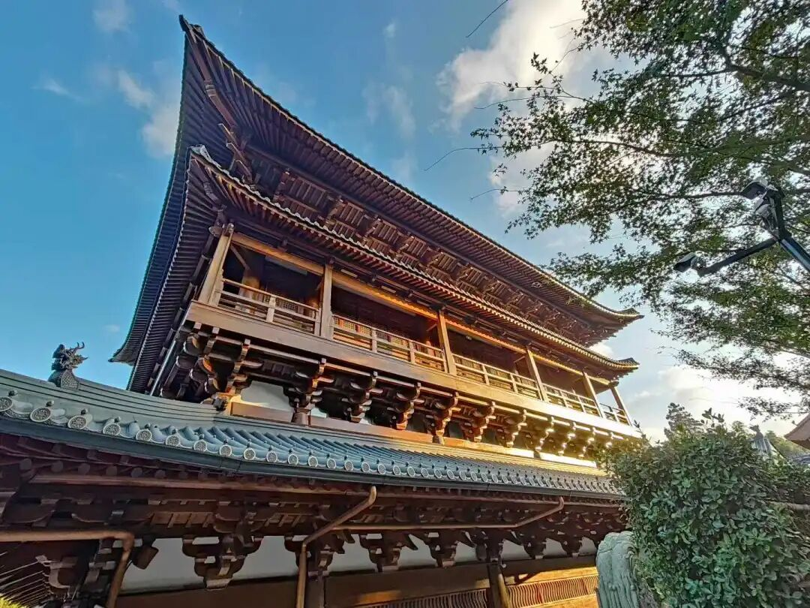

**“二乘無學迴趣大乘，從初發心至未成佛，雖實是菩薩，亦名阿羅漢，“應”義等故，不別說之。”**

二乘无学，比如说而成的阿罗汉回心趋向大乘，回小向大，从最初发心至未成佛，虽然实际上是菩萨，但在此“亦名阿罗汉”，

“應”義等故，不別說之，这个就是昨天我写微信的时候也提到过的，看到回小向大的罗汉，初学在辩论当中看到这个通常头就大了，因为这是一个“特殊情况”。

这里说的是《成唯识论》、护法系的说法。说二乘阿罗汉回小向大，按照唯识的说法，他是烦恼障是全部断完的，但是要注意，同样是按照唯识的说法，（一向大乘行者，）连第八、第九地的菩萨这个烦恼障都没有完全断完，他还有一品种子没有断。（中观当然不这么说。我们现在说唯识就说唯识。）

那么他是什么？他是“大乘”吗？是大乘。是“阿罗汉”吗？是阿罗汉，就昨天我讲了，那他是不是“大乘阿罗汉”？他不是“大乘阿罗汉”，因为“大乘阿罗汉”是佛。回小向大的“阿罗汉”，他的菩提心发起吗？发起菩提心，他是大乘菩萨吗？是，他是不是大乘阿罗汉？不是，他是阿罗汉吗？是！他有这个“应”的意思吗？有，因为他原来是证过阿罗汉，这就是“应”，是大乘的“应（供）”吗？不是，这个“应供”就是这个阿罗汉的意思。

“不别说”，那我们就不再说了。

比较要小心的地方。对唯识而言，这类回小向大的罗汉是非常特殊的（主要是简单标准化讲起来特殊，人数上来说、比例上来说未见得少）。为什么？因为他在断烦恼方面已经胜过八地菩萨了，胜过八地、九地甚至胜过十地的菩萨了。但是他在断所知障方面，他连初地的菩萨都不如，在福报方面，可能连资粮道的加行道的菩萨都不如。在这个方面他是比较特殊的，要辩论的时候要小心这个特殊情况。

