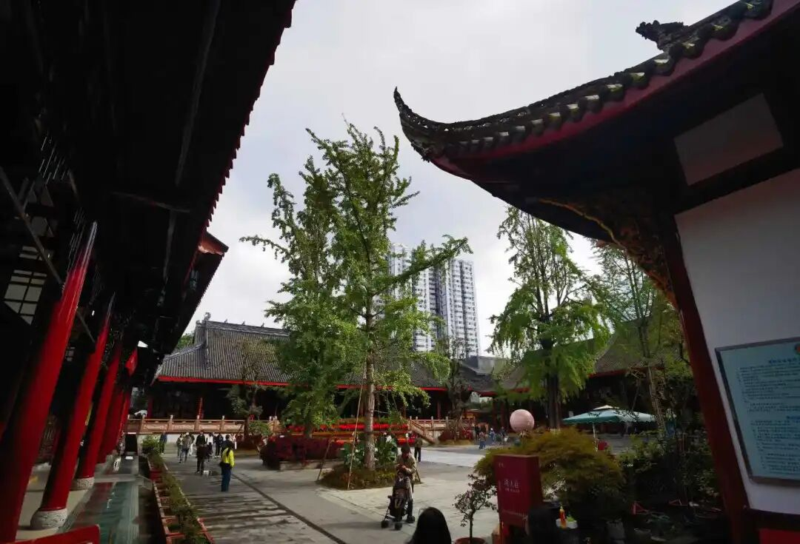

那么现在对这个《唯识三十颂》的颂文本身，他是要再加以解释的。解释了，这个问题就出现了，就是《唯识三十颂》本身是“不太了义”的，需要解释解释。当然唯识也可以这样，承认颂文本身基于文体的缘故“不太了义”，需要加以解释。

《唯识三十颂》这些文字上的不精确，确实也造成了大家不同的展开，十大论师大家各自法发表不同的说法……其中一个主要原因就是因为《唯识三十颂》是世亲的晚年的作品，他自己没有给以解释，没有《三十颂自释》，这就留给弟子们解释的空间了……

留给弟子解释，就各安本分……据圆测大师说：

“**然諸釋中，所宗各異：護法、難陀等，多述宗旨，會釋違文；火辨、親勝，正釋本頌，以標論意；安惠菩薩建立比量，斥他宗失……由斯諸本別行，攝義皆不周悉者……** ”

说护法解释起来基本上不是很照着文字来，“会释违文”；而安慧比较喜欢用因明……不过实际看起来，安慧倒是类似“正释本颂”的，安慧的《唯识三十论释》中没怎么看到“建立比量”啥的……

安慧基本上按照文字本身，没有就是没有，护法则要去解释说“是没有染分，不是没有净分”，他的意思是第七识还是要“有体”的，这个是他们两个人的大的差别——安慧是认为第七识就是我执，我执断完以后，这个第七识没有了，也就是说，安徽认为第七识无体。

**“如說四位無阿賴耶，非無第八，此亦應爾。”** 这个和四位无阿赖耶一样，就是前面讲了一下，哪个四位？三种阿罗汉再加上回小向大的阿罗汉，他们这些阶段都是没有阿赖耶……护法说，是没有“赖耶”这个名字所代表的那种“我爱执藏”。因为到了声闻、缘觉、包括大乘的这个阿罗汉位，在唯识而言，认为他的烦恼障已经断完了，这是说“没有阿赖耶”，就是“没有我爱执藏”的这个意思了，我执已经断完了，并不是说“第八识没有了”。

“**所說三位無末那者，依染分說，非無淨分；如說四位無阿賴耶，非無第八，此亦應爾** ”，这是唯识的说法。下面一段是加出来的，是他要讲第七识的相应的三个特点，他的意思就是要解释没有染分的末那，而末那是和哪些相应的。

