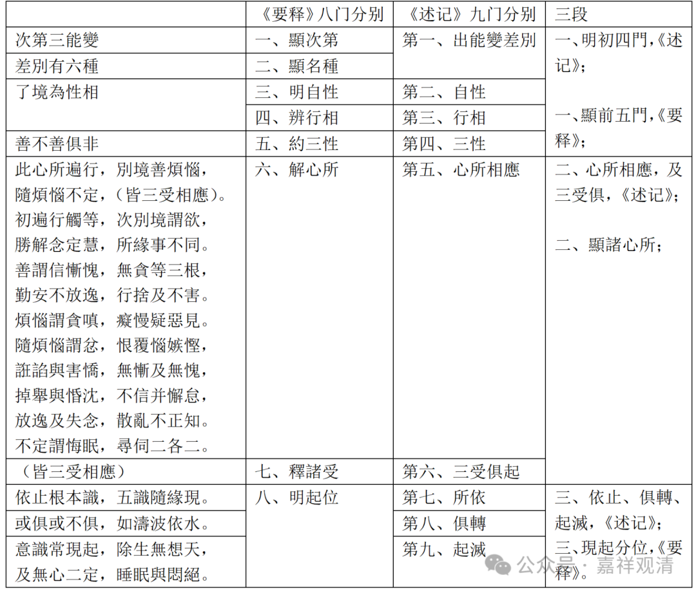

第六个，篇幅最大的是第六个，关于他的心所。他说的是三能变的心所，实际上说的是第六识的相应心所，要说起来，眼识能不能有全部的这些心所呢？说实话应该谈不上，但是在这里面谈的主要原因是什么？是第六识。基于第六识，也就是说他们好像也有一样的……

**“此心所遍行，別境善煩惱”，** 这个“此”，第三能变。其实主要是第六识，他的心所有哪些呢？五遍行、五别境、十一个善法、根本烦恼六个、随烦恼二十个、不定四个。第六识和51个心所全部相应。

第七个科判，**“皆三受容俱”** ，他是属于第七个科判里面的，但是中间因为一堆心所篇幅太广，所以要把他先讲，这个是“三受相应门”，“受”，就是苦、乐、舍受这三受。

然后广解这个第六识的心所。

“此心所遍行”，“**初”** ，就是一开始。

“**遍行觸等”，** 这个“**觸”** 还是跟前面一样，阿赖耶识部分已经说过，那这里就不多讲了，“触、作意、受、想、思”五遍行；

“**次”** ，接下去是“别境”，因为“**觸”** 等五遍行前面阿赖耶识部分已经提到过了，所以他就不展开了，触、作意、受、想、思遍行已经提到过了，就不展开了。

别境展开了一下。“**次別境謂欲，勝解念定慧，所緣事不同”，“** 所緣事不同”这一句，在梵文当中是没有的，“所緣事不同”这句解释的是“别境”，别别的境，“别”的是什么？“境”不同，“境”是“所缘事”，所以这个就是“所缘事不同”，是这个意思。这个“所緣事不同”，但是梵文当中是没有的，所以这句话在《成唯识论》当中也是没有解释的，大家知道一下就可以了。

但是这句话也不是完全没有意义，这句话其实也是在“别境”里面要加以解释的，这里面如果要辩论的话，这句话也未见得不能辩论，因为“定”和“慧”的概念、定义当中，他都是“于所观境”，所以这也未见得是“所缘事（都）不同”，所以还是可以辩论的。

但是“所缘事不同”这句话来解释别境是没有问题的但是佛教唯识宗各位大师对此解释也不一样，至少有三种说法，这个我们下面再展开。

