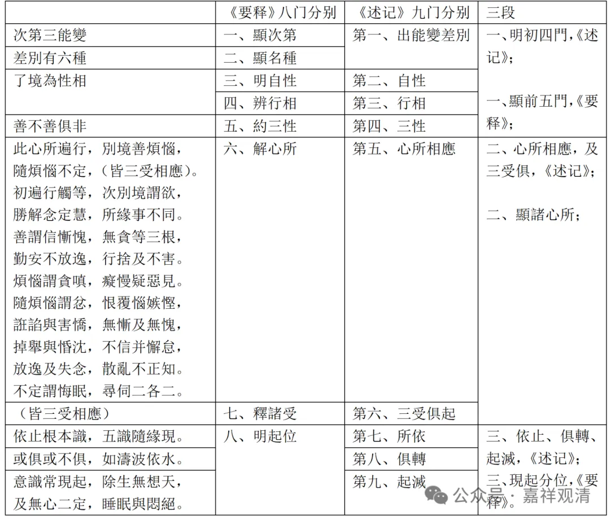

善有十一个，所以也要把他展开、铺开，“善謂信、慚、愧，無貪等三根，

勤安不放逸，行捨及不害，”善心所当中，信单独是一个；“惭愧”这是两个，“惭”和“愧”这是分开的；无贪、无嗔、无痴、这就是“无贪等三根”；然后“勤”就是精进，“安”就是轻安，不放逸、行舍、不害，一共十一个善法。

根本烦恼，一个是贪、嗔、痴、慢、疑、不正见，这是根本烦恼。

随烦恼二十个，小“随烦恼”：“忿、恨、覆、惱、嫉、慳、誑、諂與害、憍”，这是十个小随；

两个中随：“無慚及無愧”，前面讲过的是，反正是有不善的这两个都要有；

大随：反正你有这个烦恼的时候，这八个都有：“掉舉與惛沈、不信并懈怠、放逸及失念、散亂、不正知”这是八个大随。

我们也前面讲过，小随、中随、大随的分判，也就是《成唯识论》或者《唯识三十颂》是这么讲的，其他地方不是这么讲的，或者说是只有《成唯识论》是这么讲的。

“不定”有四个“謂悔眠”、“尋伺二各二”，这是四个不定心所。

然后接下来两颂，《唯识三十颂要释》说这两颂都是“明起位”，那么依《成唯识论》好像分得更细一点。

“依止根本識，五識隨緣現”，这个是“所依”。

“依止根本识；或俱或不俱，如濤波依水”，这个“俱转”，也可以说是一个比喻的差别，如濤波依水；

然后意識常現起，除生無想天，及無心二定，睡眠與悶絕”，他在这里面说的是意识有时候是有的，有时候是没有的。但这里面要讲的话又复杂了，这个又变成跟前面是一样的。这个到底是有还是没有？他是不现起，所以如果单纯的是不现起的话，那中观可能还是要讨论的，你既然不现起，那我们讲只有六识也没有什么区别，我们也讲不现起就可以了。

这个大家知道一下。这个是三能变，泛泛的我们就先这样讲一下，差别呢，如果按照第一个初能变的十门分别，这里也可以开十门分别的，前面有个“显次第”，把这个《成唯识论》的第一个科判分成两个，就是十门分别了。

