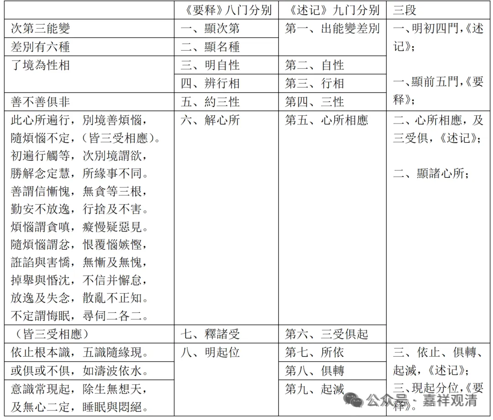

现在讲到第六识，我们还是展开前六识讲一讲，按照《唯识三十论要释》作展开讲一讲。

**“釋。自下九頌，顯第三能變。於中總以八門分別：一、顯次第；二、顯名種；三、明自性；四、辨行相；五、約三性；六、解心所；七、釋諸受；八、明起位。”

第三能变有六个识，“次第三能变”是“显次第”；“显名种”有六个，就是六个识，“差别有六种”；“明自性”，就是“了境为性相”；“辨行相”，还是了别境，叫辨行相；“约三性”，叫“善不善俱非”；解心所，51个心所；釋諸受，三受；明起位，就是最后的两个颂子。

** “雖有八門，攝為三段：初有一頌，顯前五門；次有六頌，顯諸心所；後兩頌顯現起分位。”**

第一颂当中摄五个科判；接下来六颂展开五十一个心所；最后两颂明现起分位。

大科分三段，仔细分的话，可以分八段，也可以分十段，九段、十段都可以分，看你想用哪个分都可以。

** “‘次第三能變’者，此顯次第。故論釋云，‘次中思量能變識後，應辨了境能變識相’。”

然后“次第三能变”，这是显次第，“**次”，** 就是中间思量能变，也就是第二个思量能变的以后，然后再广辨了别境识相。这个《论释》是《成唯识论》。

**“‘差別有六種’者，此辨名種。”**

这个泛泛的讲也就可以了，本来可以展开讲的，我们就不展开讲了。这个展开讲太复杂了，至少又是一节半课、两节课的样子。

** “此識差別，總有六種，隨六根、境，種類異故，謂名‘眼識’乃至‘意識’。”

“此识差别”，就是第三能变的差别，差别就是一个一个；“总有六种”，一共有六种；他随六根和六尘有不同的差别，就称为叫眼识乃至意识，前六识。

**“隨根立名，具五義故，五謂依、發、屬、助、如根。”

一般来说是隨根立名，所以这里面要加字，一般来说他隨根立名；他为什么叫眼识乃至意识；什么叫“依、發、屬、助、如根”呢？看一下，大家知道一下就可以了。

