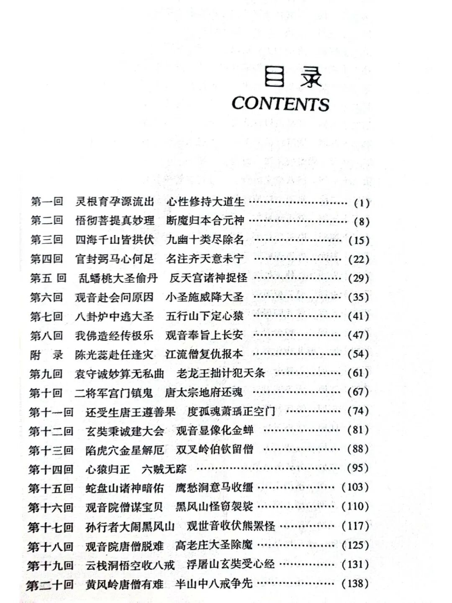
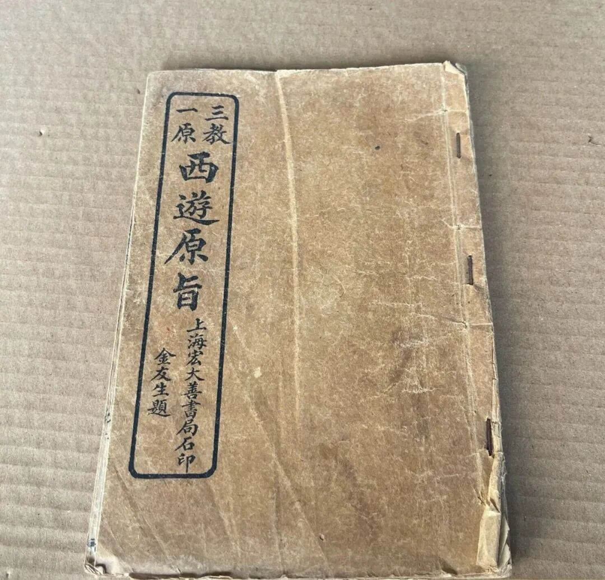

**初墮於境，名“率爾墮心”。** 比如说眼睛刚才还在看电脑，一下子看到杯子，这个第一刹那的看到杯子，这个叫“率尔心”，或者叫**“率爾墮心”** 。

“**同時意識先未緣此，今初同起，亦名率爾。故《瑜伽論》第三卷云：意識任運散亂，緣不串習境時，無欲等生，爾時意識名率爾墮心，有欲等生尋求等攝故。** ”

我们有一个问题，前五识缘境的时候同时会有一个叫五俱意识，就是和前五识同时它会有一个意识，叫五俱意识。这个马上要考……

“**同時意識，先未緣此** ”，比如说我眼睛看到这个杯子，那么会有一个五俱意识也在缘这个杯子，但是前面这个“同时意识”没有缘这个杯子，叫“先未緣此”。

“**今初同起** ”，他说现在第一次“初”和眼识他堕于境的时候，“同”时生“起”，这个时候意识也有一个“率尔心”。

这句话看懂了吗？它为什么要加这句话？这里说这句话，他是补充《瑜伽师地论》“**初是眼識，二在意識”** 这一句的。《瑜伽师地论》说“**初是眼识，二在意识。** ”，那么假如这句话说的就圆满了，那么，“初是眼识”，那第一刹那“率尔心”有意识吗？还记得吗，我们还讲过有一个“五俱意识”，和前五识一起有一个意识……

按照《大乘法苑义林章》的说法，他说这个时候意识也有“率尔心”，不单是“初是眼识”。然后接着举理证，举教证。

他说**“《瑜伽师地論》第三卷云：‘意識任運散亂’”** 。意识就是一会儿缘到这个一会儿攀缘到那个，任运散乱……

你们看西游记管孙悟空叫什么，叫“心猿”加上那批白龙马，那就是“心猿意马”。你看他的《西游记》的每一回名字里面很有点意思的——

这个道家、儒家等等都在去对着它进行发挥的。你看他在说孙悟空的时候，他在《西游记》的回目当中会讲“心猿”。也就是说《西游记》不管他是有意的还是无意的，他是把孙悟空比作“心猿”，猪八戒叫“木母”，这个又是道家的，要去修炼丹的。

《西游记》是道家、儒家、佛家都对他进行解释，这个“心猿”这个意思特别明显，直接就说他是孙悟空就是意，心任运散乱，心到处跑……

《西游记》道家有刘一明，清代的，对西游记做了大量的发挥，《西游原旨》等等，至少有两本书是发挥西游记的，然后儒家也有，儒家我见到过，我在新疆看到过，大概有三本，我好像买了，是用这个“大学之道在明明德……”，用“大学之道”在解释《西游记》的，好像有三本，挺厚的，用儒家的大学之道解释《西游记》的。佛教解释西游记的也有，贡唐仓也解释过《西游记》，你们有兴趣都可以去看看。

（是意识的前一刹那没有缘这个境，不是意识没有缘这个境，前一刹那的意识不是缘这个境，也就是说前一刹那的意识可能你在看电脑屏幕，然后眼睛这个时候在看杯子，和眼识生起的同时还会有一个“五俱意识”，就是和前五识一起的一个意识，这个时候会有一个眼俱意识，这个意识是缘这个境的。所以这个眼识的率尔心同时的意识也有一个率尔心。）

