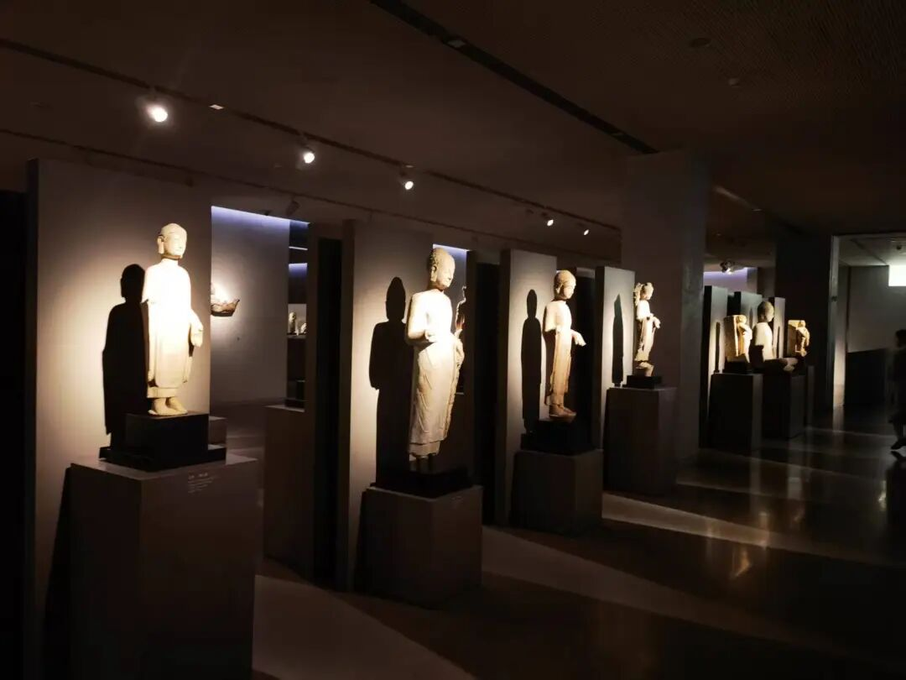

好，我们继续。补充了一下唯识的“五心章”，其他宗派好像没有专门讲的。如果有的话，大家提醒我。

今天肯定是讲不完了，我们先讲一部分再说。

我们继续回到《唯识三十颂要释》。

**“雖一一識三性不俱，六識聚中有‘容俱’義。”

现在我们再回来看，“** 虽一一识三性不惧”**。每一个识它不可能同时具备三性，但是，** “六識聚中有‘容俱’義”**。

他为什么这么说？他的意思是这样，比如说我们现在等于是六个开关全都开了，眼、耳、鼻、舌、身、意识全都开了，在用一个时间点、同一个刹那，你这个时候，可能眼识是一个率尔心，那这个时候是一个无记没问题，那么很有可能你耳识在这个时候有一个染净心，那你有染净了，你的鼻识可能又缘另外一个境……这样，同时的眼、耳、鼻，舌、身识缘几个境，再加上意识，你是有可能同时具备三性的，所以叫“容俱”。

就是你是有可能在同一个刹那的时候，这个心是善性的，那个心是恶性的，再一个心是无记性的，这个没问题吧，它是这个意思。

** “率爾、等流，眼等五識，或少、或多，容俱起故。”**

“** 率尔、等流**”就是“** 率尔乃至等流**”，第一个是率尔最后一个是等流，五心，“率尔、等流”是这个意思。眼等五识在同一个刹那，它们此时可以具有** （容俱）三性**，同一个刹那眼、耳、鼻、舌、身全都开了，你眼识可能是个率尔，那么同时的这个耳识可能是眼识染心，那个耳识起一个净心，……同时都有，所以是“** 六識聚中有‘容俱’**”義。

下面一段不多讲了，有两种说法，你们大家听大概了解一下就可以了。

** “眼等五識，或少、或多，容俱起故。”**《成唯识论》说“或多、或少”问题不大。

那么“眼等五识，或少、或多”，他怎么解释大家了解一下就可以了，或者是五识，从五识的角度上讲“** 或少、或多”**；或者从五心率爾心、尋求心、決定心、染淨心、等流心，从这个角度上“** 或少、或多”，**有这样两种解释，大家知道一下就可以了。

就是或者说是“** 眼等五识或少、或多”**，或者是“** 率尔、等流，或少、或多**”。

“** 或少、或多，容俱起故**”，也许善有一个，不善有三个两个，你说是少的话肯定是两个以下了，多的话肯定是三个以上，或者说是它有一个善、有不善两个、无记有三个，因为一共六识……所以各种情况很多，所以叫“或少或多”或者“** 或多、或少，容俱起故**”，可以（** 容**）一起（** 俱**）生起（** 起**）。

