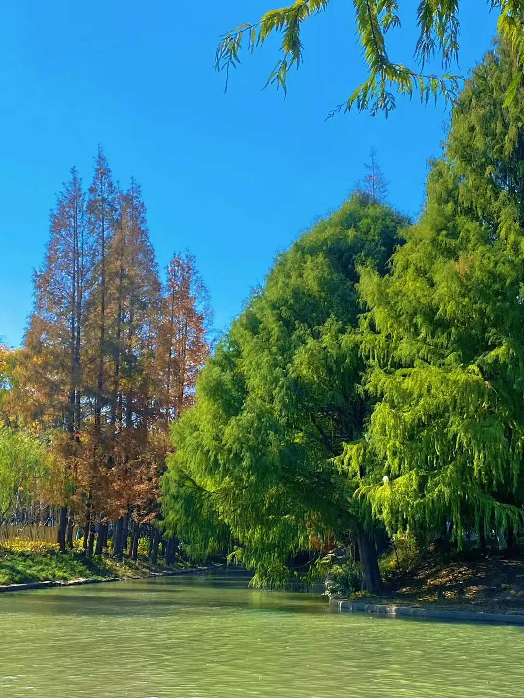

今天开始讲《中论》，《中论》的《观业品》。

××的，最近几年江湖上走得少了，江湖上都没有咱的传说了，很多小辈都在说我是搞唯识的，这上哪去说理去？！洒家正统中观师好不！看来必须讲讲本门的内容了……

所以我们就开讲《中论》了，不管了，讲到哪里算哪里了。书你们手上都有了是吧，手上都有了是吧，这是《中论》的第十七品了，《观业品》。

首先我们先讲一下《中论》的这个来源。

首先我们知道，中观派肯定是佛教是吧？

你们来的人都知道我们玩的是佛教，不是玩的道教。很奇怪，我们在外面经常有人问我“是不是道教？”我长得很像道教吗？我这个衣服很像道教的吗？真的我搞不清楚，为什么？中国现在传统文化的普遍认识已经衰弱到这种程度了吗？连和尚和道士都分不清楚了吗？道士是没有剃光头的。道士即使是光头，他也是秃了。

我见过有一个和尚，也是某某山的。他那个时候想出家，他想：我是当和尚还是当道士呢？后来他就觉得，每天要整理那么一堆头发，揪起来觉得不爽。他是四川人，他就把头都剃了，就索性做了一个和尚了。

一般而言，这个和尚和道士的身份还是蛮清楚的。

我们首先是佛教，佛教里面我们又是什么呢？是大乘佛教。

佛教里面首先我们要分大乘和小乘。大乘和小乘的差别在哪里？大乘和小乘，我们以前看《西游记》，就说玄奘法师西行是求大乘佛法，是吧？玄奘法师求的确实属于大乘佛法里面的唯识系统的内容，也是大乘系统为主，但是玄奘法师翻译的小乘的内容不少见，他其实翻译了很多小乘的书，三、五百卷有的。

那么大、小乘的这个差别在哪里呢？我们说有两种，一种是在法上分的，一种是在人上分的。就法上分，就是承不承认法无我，只承认人无我的是小乘，还认可法无我的是大乘；就人上分，就是看他是单纯发出离心，还是发的菩提心，单纯发出离心的就是小乘行者，发起菩提心的就是大乘行者……

