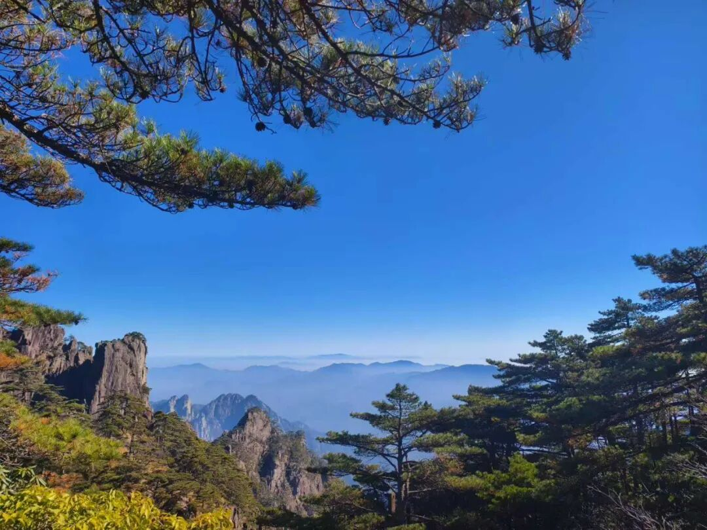

那么什么是解脱呢？我要讲一个故事了。“解脱”，就是说明我们现在是“束缚”的，我们要把这个“束缚”free解脱，是吧？解脱。

我们有一个FG法师，那也是在学汉传佛教，学了很久，没有特别的心动。结果她到英国听了一堂课，英国也有出家人、法师，也在讲佛教，然后跟他们讲，跟她讲：“什么是解脱呢？解脱就是free”，她一下子就懂了，顿悟！结果她就把一家一当都搬到英国去了。我能够理解，因为她大学本科是学的英语，她的英语比汉语好啊。什么是解脱？解脱就是free。

在求解脱的背景下，“为利众生愿成佛”，这就是发起大乘的菩提心了。而且为利众生不是为利某一个众生，为利某一个对我好的众生。很多人说“我有慈悲心，我对某某人好，我就生慈悲心”。不是，你这不是慈悲心，至少不是佛教标准的慈悲心。“我对儿子好……我对我女儿好”，这个不是慈悲心，这个是贪心为动机的。所以我们大乘佛教在修这个慈悲心之前，先要修平等心，否则你修的慈悲心就变成贪心了。当然也有人主张是直接修慈悲心。

大乘和小乘的差别，第一是在人上分的，对吧？在解脱的背景下，大背景是什么？解脱的背景下。一个是有道德的最高理想，为利众生愿成佛。一个没有最高的道德理想，它仅仅是以个人的解脱，或者以少部分人的解脱为目标的。这个就算是小乘，因为他装（乘）得少。小乘不是不装人，也不是只管自己。

小乘有没有只管自己的呢？有，也有的。在《阿含经》当中也有的。像舍利弗，也度众生，他可以讲经，很多人来听课，对吧？他是愿意。还有一个人，水平跟舍利弗是一样的，舍利弗有的能力他也全都有。但是一他年纪大了，好像是120岁了。他天天就在山上打坐，不肯下山讲课。然后其他一些罗汉就找到他了，说：“你的水平很高，你的智慧、功德，包括神通、四无碍辩都像舍利弗，你干嘛不出来讲课呢？”他说：“哎呀，已经有舍利弗这些人了，我就在山里面享受就行了。”他享受解脱的快乐，他不想讲课，他不想做其他的多余的事情。这种可以说是小乘的明显的代表，是吧？他只管一部分就可以，不愿意过多地承担责任。

你看舍利弗有时候也是一样，有时候是小乘的代表，他也有这种情况，就是他在碰到一些困难的时候，他会选择退了。一个就是在历史上，他本来是发大乘心的，后来碰到恶毒的众生，那个众生就问他化缘说：“你是修菩萨法的，那我问你化缘，你应该都要给的。”然后舍利弗说“给”。那个人说“我化缘你一只眼睛”，那舍利弗就给他挖下来了，给他了。那个人拿到这个眼睛，说“臭的”，扔在地上踩了一脚，这一脚把舍利弗的菩提心给踩灭了。

然后舍利弗因为这件事情，就想：“众生都难度，太难度了，不能解决所有人的问题，算了，解决一部分人或者自己解决就可以了……”舍利弗从此从大乘的心，大乘的发心退回小乘的发心。但是他是修了60劫，很长时间去修佛法，所以他就成为小乘的这些罗汉当中最聪明的一个人。因为他修的时间很长，但是他以前是修大乘的，后来修小乘了，后来觉得这些人……。

确实，我们现在世间的人实在太坏了，其实我们也挺坏的，我也能想出很恶毒的一些想法，是吧？

