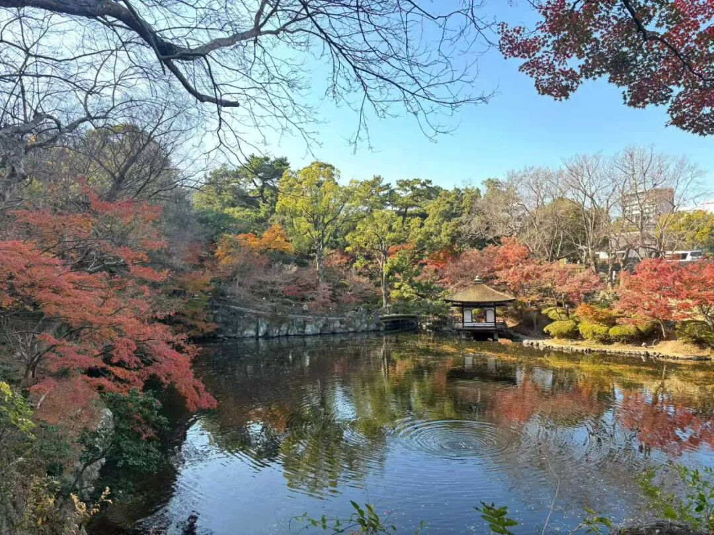

第二个是在法上分的。比如说有时候我们讲“这是小乘的经典，那是大乘的经典”……这个是怎么说呢？按照传统的说法，只讲“人无我”（补特迦罗无我）的是小乘的，除了“人无我”以外也讲“法无我”的，这个就是大乘的。但是，这个只是传统的一个说法，如果放开的话，不完全如此。但是传统上是有这个说法。

小乘的什么呢？我们佛教讲无我，是吧？仅仅讲人无我，或者补特伽罗无我的，这个就是小乘了。不仅是讲“人无我”，也讲“法无我”的，这个就是大乘的。这个泛泛来讲，包括一般的教科书都已经这样了，包括宗义书也按照这个讲，应该没问题了。但是如果按现有的文献撇出去讲的话，这就不够了。因为经部的像《成实论》，他是承认“法无我”的。

包括我们跟阿难聊天的时候（“阿难”是一个南传的比丘，不是那个佛的弟子阿难，否则我跟阿难关系好，我觉得我突然之间我自己身价也跟着涨了，哈哈。）也发现，说小乘不接受法无我。这个可能有点武断了。我们后来跟他阿难聊这个法无我，他后来看了一下，他说这个我们可以承认、可以接受的。就是他们是可以接受的，但却是不是他们的核心观点。

还有就是很多我们现在在讲这个南传的森林派等等。其实今天从南传到我们今天很多人其实水平也不咋地，他在汉传也没学好，然后你就以为他去学个南传就学好了吗？也不太可能，他们会去学南传的阿毗达摩吗？他们只是泛泛地接触一下，回来的那些……他们的阿毗达摩大多也挺臭的。

像阿难他们，阿难他们泰国是有考试的，我也想玩，我也想向他们学习。他们有考阿毗达摩，从1级到9级。你们看到他们一些国师边上都会有一个大扇子，这个扇子代表他的等级。这个扇子一出来，你看八级的阿毗达摩，九级的阿毗达摩。这个八级九级的，国王要送他们一个大扇子，出来的时候边上就竖在那里，我想我们以后也竖一个。

这样，我们以后我们考虑一下，我们搞那个勋章是吧？重要的经典，背出一个的，发什么勋章是吧？背出几个的发什么勋章。然后比如说讲课到什么程度的，给发一个扇子。将来我先给自己发个最大的，发个等级高一点的，就像常凯申给自己发一个五星还是什么勋章。我们也搞一个。

