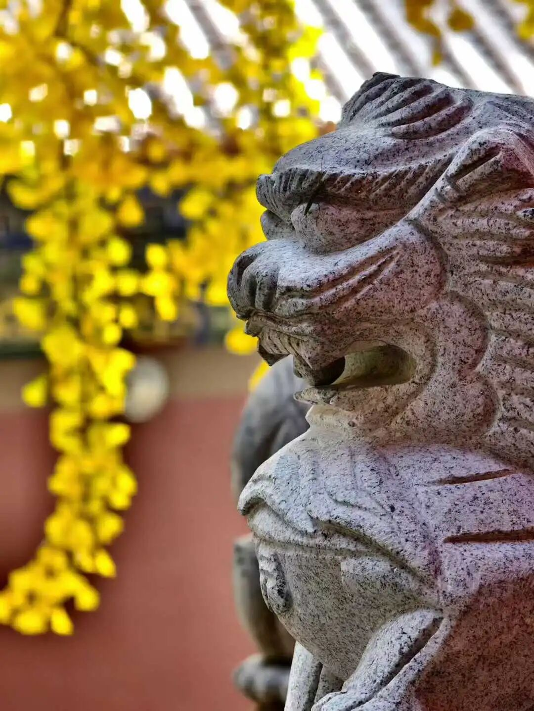

后世的佛门“修士”，你让他打好基础、读大量的书……这种基础功夫他是不干的，所谓“秦人好简”，他只看自己一两本书。所以这些经论就很冤枉，因为最应该“爱”他们的人却弃之如敝履。

我去西安兴教寺，玄奘法师的全身塔在那里（边上还有基大师和圆测大师塔），他那个月亮门，我一进去我就哭了，脚都迈不动了……直接就蹲那儿了，哭半天……心里面觉得很委屈，很冤枉、很委屈的感觉，自己也感觉到自己对不起人家。

玄奘法师翻译了1335卷的经书，我们除了《心经》可以背得出来以外，其他都背不出来了。大师辛苦求学、取经，后来翻译了这么多，就是让我们学的，是吧？我们还不愿意学，还不愿意看啊。现在很多半文盲还看不起人家，说他翻得不准确，我们自己不知道自己几两重……

哎，我们这些后辈真的是对不起他老人家，人家大师为了我们能够轻松地去学习，翻译了这么多东西，把这一辈子都砸进去了……我们这些后辈真的不是东西，全是×××假学佛，世间人想的是“无灾无难到公卿”，学佛人脑子里想的是“从今天无知懵懂，到明天一觉成佛！”

我们如果判教的话是什么呢？《中论》是大乘还是小乘？是大乘的法。那么它是中观还是唯识呢？大乘里面按照宗义里面来说，只有两个，是吧？只有两个宗派，或者只有两个系统，一个是中观，一个是唯识。

那么它是中观还是唯识的呢？应该说，在龙树的时代，当时还谈不上大乘的分派。今天我们说它是中观的，因为它的名字叫《中论》（Madhyamakasastra）、《中观论》、《中观根本慧论》，是吧。但龙树在那个时候是以大乘的代表出现的。那个时候，中观和唯识两个作为佛教史上的两大学派还没有出现，中观派Mādhyamika‌这个词也没有出现。

你们看这个书，叶少勇老师的这本《<中论佛护释>译注》，他这里面也有一段，这个书里面他提了一半，没多说，他说什么呢？他说他比较接受日本斋藤明的说法，说什么呢？说龙树出世的这个时候，尚没有“中观派”（中派）Mādhyamika一词。他这本书第8页说：“一般认为中观派的开创者是龙树。斋藤明(1988, 40)研究指出，6世纪的清辨最早使用‘中观派’(梵文:Mādhyamika，藏文:Dbu ma pa)一词来标称自派并与瑜伽行派形成对立，因此清辨应被视作中观派的实际创立者，而龙树则是‘大乘阿毗达磨’的肇始(Saito 2006)。中观派则肇自清辨”……

我来解释一下这个说法，这是说“中观”Mādhyamaka一词在龙树这个时候已经出现了，因为有《中论》，是吧？《中观论》这个时候出现了，但是“中观派”:Mādhyamika这个名词是从清辨开始出现了。以目前现存的梵文文献，在清辨之前没有出现“中观派”这个名词。但是如果一定要说“中观派”从清辨开始，似乎也不太好，应该说“中观派”这个词的出现，目前最早发现是清辨论师开始用的。

Z地的说法，说龙树和提婆称为“根本中观派”，后来的称为“随行中观派”，这个可能会比较好一点。就是“中观”这个词，龙树那个时候有了。龙树的这个套路，我们认为他和后面的中观派，应该是很接近，或者说是一脉的，对吧？很接近，或者一脉的。这个他是不是就完全等同于呢？应该也不能说完全等同，否则就不会有“根本中观”和“随行中观”一说了。

