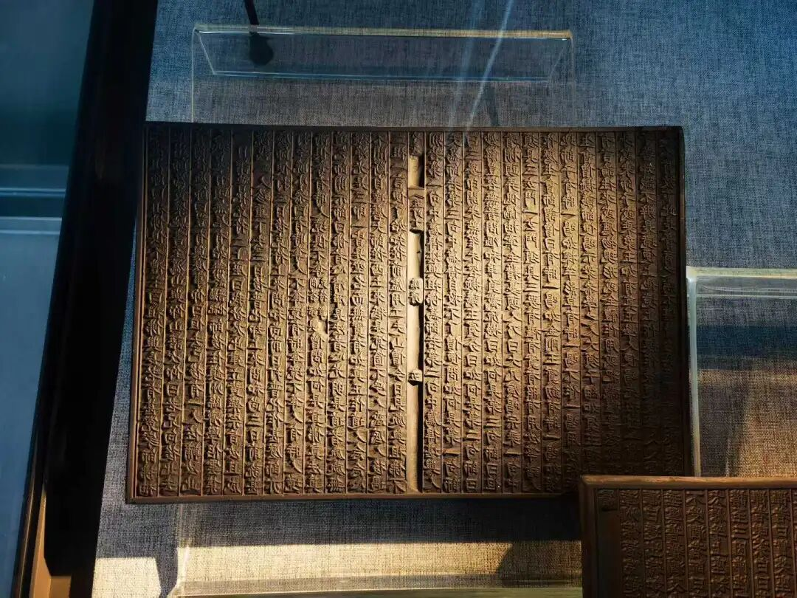

“謂：遍行五；別境亦五；善有十一；煩惱有六；隨煩惱有二十；不定有四——如是六位，合五十一。”

为哪六类差别？遍行五：触、作意、受、想、思，别境五：欲、胜解、念、定、慧……

大家背的时候不要按照《百法》的“一触、二作意”等等，不要，直接“触、作意、受、想、思”，“欲、胜解、念、定、慧”这样背下来，你一下子背五个，如果是“一触、二作意......”你一次背的是一个，就“遍行五个，触、作意、受、想、思”，“别境五个，欲、胜解、念、定、慧”，这样背。

“善有十一，烦恼有六”，善法十一，是：信、惭、愧、无贪、无嗔、无痴、勤、安、不放逸、行舍、不害。

“烦恼有六”，是指的根本烦恼，贪、嗔、痴、慢、疑、不正见。

随烦恼有二十，我们看，开始是没有分大随、中随和小随的，大随、中随、小随如果要说分的话，是一定要在《唯识三十颂》以后，到《成唯识论》再分，一般来说是看不到的，也就是“大随、中随、小随”的说法是在《唯识三十颂》的护法的注解当中才会出现，因为他这个说法别人并不主张的。所以一般来说是不再展开，汉地很习惯把它重新展开，这个并没有错，因为汉地本身就是护法系的，那么会把随烦恼展开为小随、中随和大随。

忿、恨、恼、害、悭、嫉、谄、诳、嬌、覆小随，中随是无惭无愧，大随是剩下的八个。

不定有四，悔、眠、寻、伺，不定心所。

按照现在的说法，我们看起来什么，就是世亲论师和他的另外一个作品《俱舍论》的讲法就完全不一样，很不一样，大家有兴趣的话去对照一下。我虽然已经做了这个表格了，但如果你们自己做表格的话，自己可能更容易记住，不过说实话，我做的表格了，我也没记住。我只是知道这个，如果要去找的话，我去找我自己做的表格就可以了，找我自己写那个论文就可以了，那大家去对一下，知道一下就可以了。

心所法，按《百法》系统，加起来这是五十一种。

