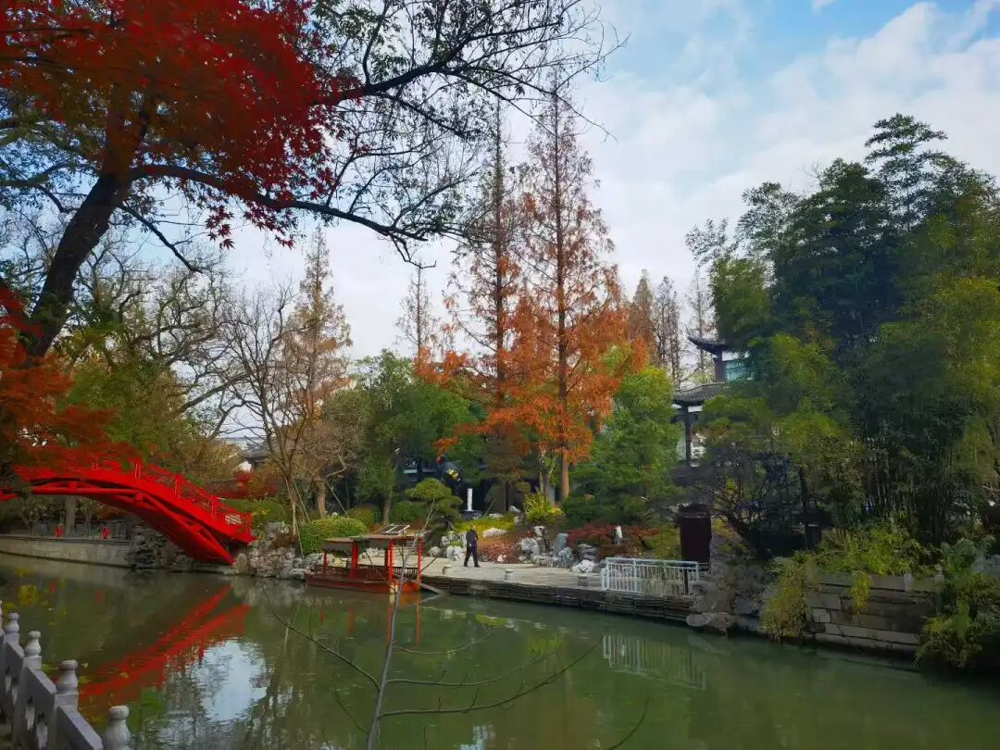

“中观派”这个名字从清辨手上开始出现，历史原因是什么呢？因为当时唯识系统是显学了，唯识系统就用他们唯识的这种理解，来解释《中论》。比如说你说的《中论》“八注”，《中论》的八个注解当中，其中就有唯识派的四个注解，但现在也仅存地就剩一个了，就是安慧的注解。安慧明显是唯识派的大师，和清辨差不多同时。

那么唯识派用唯识的方式，用弥勒学的方式，也在注解中观的这个书。那个时候，清辨在学习的时候，就提出质疑说，“龙树的意思好像不是你们这样，龙树和弥勒的套路不一样！”

清辨后来还有一个传说，很戏剧化的。

中观派的人都很轴，“都”很轴这么说可能不太好。中观派的代表人物很轴，几个代表人物都是，包括清辨论师。清辩论师也很轴，当时他水平高、名气大，据说他的“常随众”（一直在他身边，跟着他走的）有2500人，释迦牟尼佛的常随众是1250人，对吧？佛经里都说“千二百五十人俱”。

跟着清辨的常随众有2500人，清辨还要跟玄奘法师的师公要去辩论。玄奘法师的师公是护法，清辨要去上门PK……据说护法是躲了。以今天金牛座的观清法师的思维，我认为护法大师是因为养不起2500人泡的（哈哈），“2500人要到我这里，吃我的、用我的，弄不好还得辩论几个月、几年（传说稍后唯识师月官和中观师月称辩论了七年）……我还是先躲了，我实在养不起他们。惹不起我还躲不起吗？”

那么，清辨的意思就是说，我们（中观派）和你们瑜伽行派的核心观点是不一样的，所以专门造了一个“中观派”的词出来。

那么清辨对弥勒也是服的，因为弥勒是马上要成佛了。所以清辨说“我要找弥勒问个清楚！”，他要找弥勒问个清楚。他又没有能开禅定功夫上兜率天去问（历史上很多，义净法师《大唐西域求法高僧传》中就提到），没有到那种禅定功夫，上不去。于是清辨就去学那啥法，然后加持芥子（芥子就是很小的，比芝麻还小的那种，一粒粒圆的，是一种药材），他用那个金刚手的咒语加持这个芥子，然后开一个石窟，相当于一个山，开一个石窟，这个石窟就开了，清辨就走进去，然后封住了。他就这样要等弥勒来，要跟弥勒问一问：“What are you弄啥咧！？”“你为什么要这么说？”要跟弥勒现场讨论一下，“你为什么要用三性三无性来解释《般若经》？”

呵呵，大师也很轴！清辨也是一个很轴的人。

很轴的清辨大师就提出了一个新的名词，叫“中观派”Mādhyamika。也确实很有道理，所以大家都沿用了。中观和唯识很明确、正式的分野，就在安慧、清辨的时期，就是从这个时候起，中观师有了独立的、清醒的宗派自觉，同时也造成了他大乘的对手——瑜伽行派也“自觉”了，说“我们跟你们确实不一样”。

