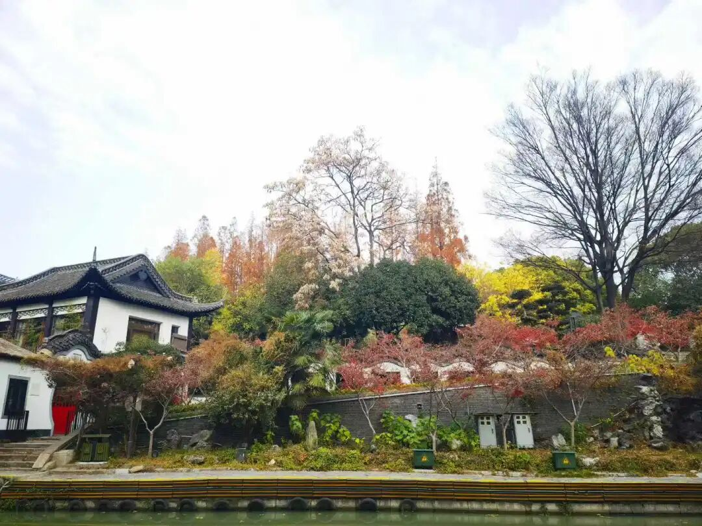

**“一切心中定可得故；緣別別境而得生故；唯善心中可得生故；性是根本煩惱攝故；唯是根本等流性故；於善染等皆不定故；故有如是六位差別。”

一个一个，每个封号都可以说是解释六位之一。

什么叫遍行？就是“** 一切心中定可得故**”，意思是，凡是有心的就有他，普“遍”随“行”，这叫“一切心中定可得故”。但这个也是大部分来说的。为什么呢？比如我们说灭受想定，遍行是五个触、作意、受、想、思，受和想，但是灭受想定没有受和想，所以应该是就绝大部分的来说，或者“绝大部分来说，一切心中定可得故”。再比如无想定，他连想都没有了。

这些遍行、别境是怎么出来的，就是从《阿含》里面把它总结出来、归纳出来的。单纯看某些《阿含》里面很明确的遍行，“有心的时候就一定有触”和“有心的时候就一定有作意”是有的，他的意思，有心的时候要有作意，有心的时候要有触，这两个绝对要有的。想和思，还是在另外的经典里说的……后来所谓的“遍行五”或者“十大地法”（“五遍行”和“五别境”加起来叫“十大地法”），这是后人的总结。

谁的总结？（如果要讲的话，又撇出去了，）有部的总结，有部不是讲六因五果吗？它的因当中就有这个叫“相应因”，“相应因”主要就讲的十个，后来单独称为叫“十大地法”，“大地法”的意思就是反正有心的时候就有它，那么唯识就认为，这五个别境心所不是所有的心都有的，只有遍行五个是随时和心相应的。

如果再仔细讲的话，唯识当中也有人认为别境必须同时生起的，有人认为的，我去年写过一篇论文，也有人认为。是德慧还是谁？就是有两个人有这样的说法（哈哈，自己写的论文自己忘了！），那么现在我们就说通说，或者是护法、安慧等等的通说——遍行、别境要分开的，遍行是“一切心中定可得故”，别境不是，别境是“** 緣別別境而得生故**”……

