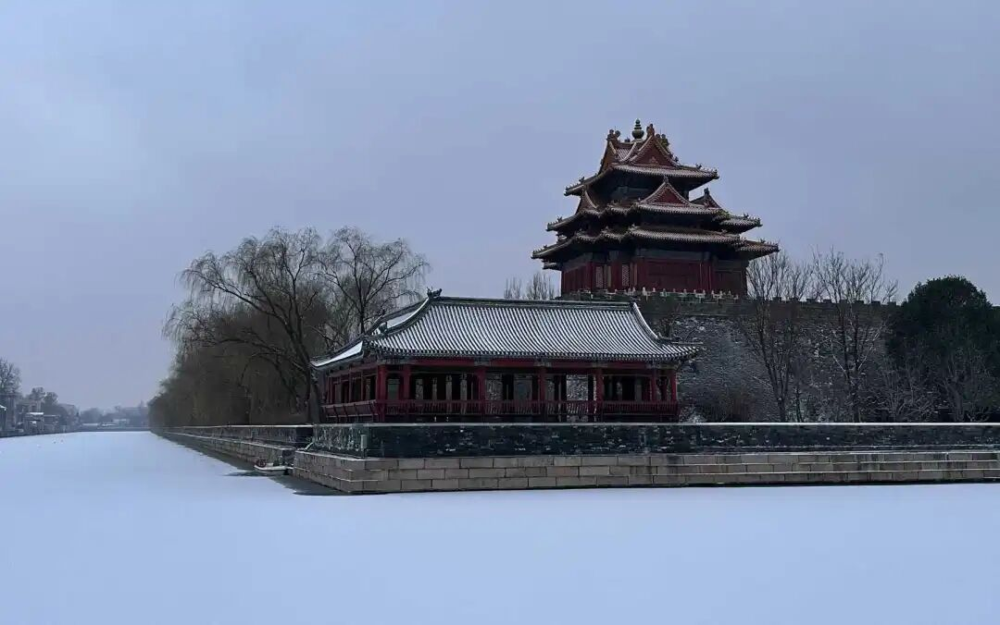

那么中观（应成）在说什么呢？中观在说，“凡是事物都必须依赖他”。你看这句“Everything is what IT is and not another thing.” “万物有本然，终不为他者”，这句说的是什么呢？和中观正好相反，这是说“凡是事物都不是除了他以外的”。听得懂吗？事物只是自，而不是他……我就是我，手机就是手机。中观派说什么呢？说凡是事物，都必须依赖于他。凡是存在，你都不是自存的，都不是自己决定的，不是what IT is，而是什么呢？“他IT”都是需要依赖于“他的条件”，IT都不是自存的。

中观自续派，他的解释是……你们听着，我们不用中观应成的解释，掉下来一点，最高的对大家来说太难了，降下来一点，降下来一点。中观自续派怎么解释呢？比如说只要你们想一想，只要你举得出来的事物，它一定是一个事物，它一定是一个整体。或者你可以举出一个事物，它是一个整体。凡是整体都必须有它的支分。可以理解吗？就是你也可以说凡是事物都是一合相，都是和合的，对吧？然后凡是事物它都要有依赖于它和合的这些基础条件（部分），凡是事物都至少要依赖于它的这些条件而存在（整体依赖于支分而有），所以凡是事物都依赖于他而存在，都不是自存的，不是自己决定自己的。

弟子问：假设世界上有基本粒子，那这个基本粒子可以不依赖他。

回：那我们就说没有这个基本粒子了。基本粒子在佛教就是“极微”，最极微小，相当于基本粒子。大乘说，极微是思想（分析）的极限，不是客观的物质的极限。就是说，假设有基本粒子，那这个基本粒子它有没有它的支分，有没有它存在的条件？如果它有它存在的条件，它就不是依赖自而存在，不是唯独依赖自而存在，它一定要依赖于他而存在，比如它的支分。

如果降下来从唯识角度，它至少要依赖于什么呢？比如说“能”和“所”。比如说，桌子是“能承载”，然后上面叫“所承载”。那么离开所有的“所承载”，“能承载”这个单词都不应该出现。假如说所有的“所承载”都不存在，那“能承载”这个单词是不需要出现的，它至少需要一个相对的存在。“能”“所”这个能理解吧？唯识的角度，一个事物存在，他至少先需要有一个“能”一个“所”是吧？哪怕是无为法，它也得被认识。它如果不被认识，它也不存在了。能理解吧？

所以中观派跟其他宗派在谈这个事情的时候，中观派说没有一个终极存在。哲学里面讲的本体论，事物总归有终极的存在。中观派会问：为什么？“事物总归会有终极的存在”，这句话的理由呢？为什么呢？

我们通常的人会认为，我们在做这件事情的时候，任何人做这件事情的时候，背后就会有一个支配者，对吧？最后，神就这样出现了，找到最终的支配者，就是神。那中观要问了，“神的存在需不需要依赖其他的条件？”

所以在中观派的观点当中，他认为宇宙也没有一个终极的开始，“无始”，宇宙没有一个开始。我们的生命也没有一个最初的开始，原始——最初的开始不存在。为什么？如果有一个最初开始的时候，那它就没有因了。如果它没有因，那它不存在。事物一定要有它存在的基础。

那中观认为，“神”也是一样。如果神是存在的，但又说神是没有因的，那就是矛盾的。几乎所有的宗教都会有说法，1、神是存在的，然后2、第一因、最高神他是没有因的，他是第一推动力，对吧？他是第一推动力。我们佛教是说，这个我们不承认的，他违背缘起法则。

然后他们说，比如说神是第一推动力。你问他“为什么？”，他说“没有为什么，神就是第一推动力！”你们想想是不是，其他所有的宗教在谈到神的时候，他是不讨论的，神是不讨论的。他们说“人类一思考，上帝就发笑。”

