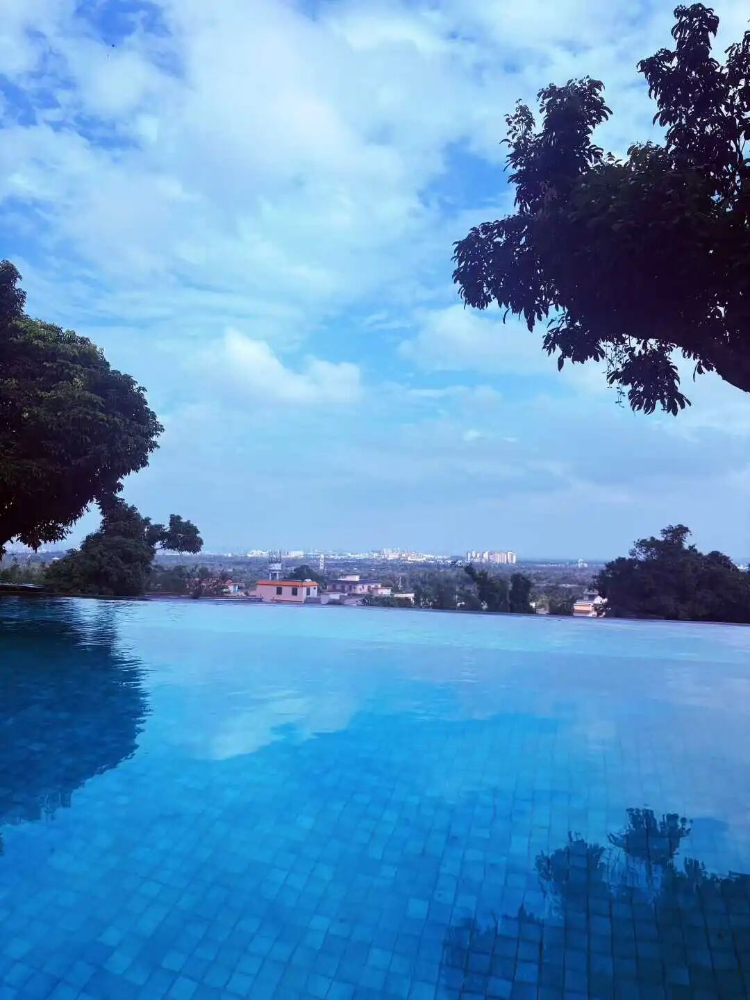

所以这一“自存”，self-being，特别是那个being，这个就出了问题了……我们是怎么扯到这么远去的……

我们刚才讲的大乘、小乘，又讲到中观和唯识解释套路不一样，唯识比较用分析的。唯识解释的套路比较娓娓道来，“事物是缘起的，缘起当中有些是主要条件，有些是次要条件……”，他用这个方式来解释“诸法不自生，亦不从他生。不共不无因，是故知无生。”同样的内容，中观派解释：事物它不是自存的，不是有自性、有自相的，所以任何的有自性背景下的自生、他生、共生、无因生都是不可以成立的。这两者在形而上学上的解释套路是完全不一样。

但是唯识系统当中也有很多人在解释《中论》，那么清辨论师他首先在这一批人当中他有了一种自觉：我们和你们不一样，你们是不了义的，我们才是究竟了义。当然唯识派也提出了自己的了义说——三性三无性。

清辨就在这个背景下就专门捻出一个新的词，发明一个新的词叫“中观派”。他说我们是中观派的。中观派这么独立以后，对面唯识派也相应兼顾了自己的立场了。义净大师说此后的印度大乘佛教：“瑜伽则真有俗无，以三性为本；中观乃真无俗有，寔二谛为先。般若大宗，含斯两意。”

中观派这个名词是清辨初创，说起来现在说是斋藤明说的，是吧？但实际上中国有一个人比他先提出“中观和唯识的分派在清辨与安慧时代”，但这个人的水平不那么高，很有趣的，他先提出的这个观点……

民国的时候，唯识系统开始出现了支那内学院等等，就专门开始讲唯识、复兴唯识。支那内学院系统讲唯识以后，就觉得中国的天台、禅宗等等都有问题。这个时候引起了但是很多有点文化和尚的反对，其中有一个叫守培法师，他后来就站出来要跟支那内学院辩论。

然后在哪里呢？我的老师跟我讲，是在上海的今天的西藏路那里。然后包了一个场子，裁判是谁呢？裁判是范古老，范古农老先生。那个时候他是佛学书局的编辑，佛教圈也算大佬了，而且又是留日的新知识分子，回来讲唯识的。所以你看守培法师在这方面就先吃亏了，对方的评判者也是唯识的。

然后守培法师和王恩阳在上海的西藏路，他们包了一个大礼堂，就在辩论，听众居士们也很多。然后辩论完以后，范古老就总结说，“王居士（那个时候还是年轻人，30岁左右）他讲得有道理。守培法师戒律很好，修行很好……”实际是给面子，委婉地说守培法师辩论输了，私下的说法是，守培法师完全不是对手，学问上欠缺太多……

那么守培法师这些老一辈的对唯识就特别不满意，甚至对护法、玄奘都很反感。因为内学院这批人他们是搞玄奘学的，搞唯识，老一辈的稍有文化的僧人就对内学院系统特别不满意。这以后守培法师他回去，回了他的寺院，好像在南通，他就努力学习，然后就自己写了一个叫新编《三十颂》，就是他用自己的想法新编了一个，在《唯识三十颂》的这个套路的背景下，新编了一个他的《三十颂》……

守培法师的学问其实不算一流的，但是很有趣的就是，一个学问不那么好的人，他靠意气之争发现了一个历史上没有什么人提出的事情——中观唯识分派在清辨——安慧时期。

现在说斋藤明先生先说的“清辨最先提出中观派”，是吧，其实是守培法师之前说的已经很接近了，他说怪就怪清辨和安慧，他们两个人之前大乘没有分派，他们两个人才是“坏东西”。大乘分了中观、唯识派……不管他是怎么搞出来的，他说对了。很有趣，其实他的学问其实不怎么入流，但是他找到的观点，这个结论其实很有新意、蛮准确的。

斋藤明虽然现在说他是1988年提出这个观点，但是应该是1930年代、1920年代这个时候中国已经有人提出了，而且还是一个戒律很好、修行很好的一个老和尚提出的。他是因为说唯识这个说法是错的，直接说唯识这个说法是错的，所以最后他对世亲都不满意了，自己搞了三十颂。很有趣了……

