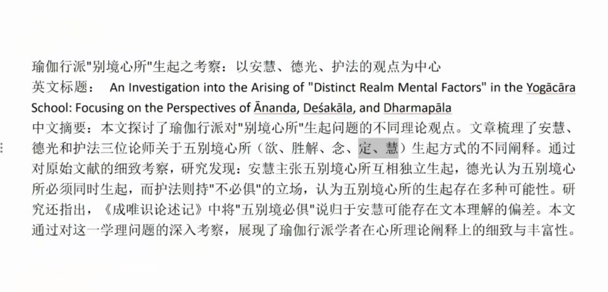

《唯识三十论要释》讲义·015·005

第一说，“遍行”和“别境”从“十相应因”当中分开了，从“十大地法”当中，把它分成一半一半。首先就出现了“别境”这个词，它的“所缘事不同”。于是在唯识当中就说既然是所缘事不同，那么心王和心所都是要同趋向一个境的，他们既然是不趋向同一个境，那就是他们必然不能同时生起，这是第一个。

第二说，是相对来说比较保守的，就是在唯识当中，有一部分和有部还是比较接近的，他就认为这五个必须同时生起，这两个观点在护法之前都有，那有一种说是安慧的说法（但是在安慧现存的注释里发现安慧并不是这个说法），还有一种说主张者是德光，这个有现存的梵藏文本和相关的注释作依据。

第三种就是护法的说法，说别境心所的生起叫“容俱”，就是它“可以”同时生起，护法认为它可以单独生起，也可以两个两个生起，三个三个生起，四个四个生起，五个五个生起都可以，五个一起生起都可以。

唯识当中对别境的生起是否“俱”有三个的说法——必俱、必不俱、容俱……大家稍微知道一下就可以了。这里《成唯识论》《要释》以护法说为正义，护法对别境的生起认为是什么？“容俱”，认为是可以独立生起，也可以五个一起生起，而且两个、三个、四个生起同时都可以。

这就是“别境”。

这个问题我写过一篇论文，我找出提要大家看一下。

看一下，三种说法分别对应安慧、德光、护法这三位唯识大师。

别境心所的生起方式有不同的诠释，安慧之主张五别境心所是必须独立生起（必不俱）；功德光认为是五别境心所必须同时生起（必俱）；一个是认为必须独立生起，两个以上不可以同时生起，功德光认为是五个必须同时生起。护法认为不必俱（容俱），不是一定要同时生起。

假如用汉文来说的话，安慧认为是“必不俱”，“必不俱”是一定不在一起，那么德光认为是“必俱”，一定要同时生起，护法认为是“不必俱”，护法认为不是一定要同时生起，也可以同时生起，是“容俱”，是“可以同时生起”。这有三种说法。

那么，这里面《成唯识论述记》说“五别境必俱说”是安慧的，我们现在看起来不是安慧的，现在发现是很明确的“必俱说”是功德光的，汉文当中在安慧的《五蕴论释》当中，有这个说法，但去看目前的梵文和藏文本，安慧没有这个说法，看来不是安慧的，就是梵文本和藏文本当中，《五蕴论》释安慧的释当中是没有说“五别境必俱”这个说法的，汉文多出来的这一段在梵藏本中是完全没有的。这里面《成唯识论述记》所引用的可能有点理解的偏差……

安慧的“必不俱”说当中也有点问题，安慧认为“五别境是各个不同的境，所以它的心是不能同时生起的”，从这个角度上来说，护法即使不能说是全部正确，至少安慧也不可能正确，为什么？因为安慧说由于是五别境不同的境，所以他就不同的境生起的心也要不同，这里就出现了问题，因为定、慧它的境是一样的，都是“于所观境”，如果是按照这个定义的话，那定和慧就显然“可以”同时生起……所以安慧的主张多少有点问题，或者他就要换定义，把自己这里的定和慧的“于所观境”给改掉。这杨也不是不可以……这个大家知道一下就可以了。

以上是去年写的一篇论文。

回来啊……

这个是针对“遍行”和“别境”讲的。遍行背后还有其他的我们就不讲了，也是一篇论文，盯着这个遍行、别境，我已经写了好几篇了，当时准备写教材的。

