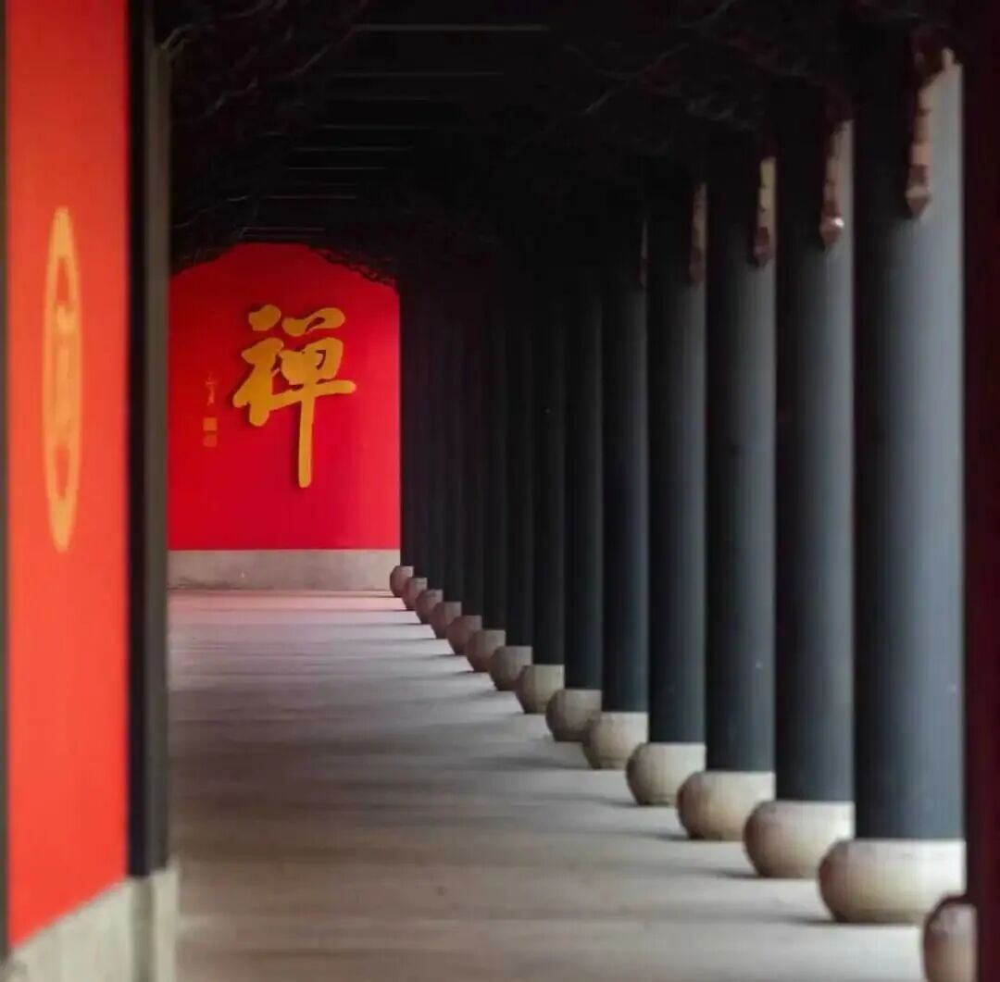

那么，“三和合触”这种说法，《瑜伽师地论》当中也出现了，什么叫触呢？“触为三和合”。

如果“触”的定义是“三和合”，那就说明“触”是一个假法。我们以前讲其他的课的时候也提到，假如说它是一个由其他东西和合出来的，他就是个假法，它不是不存在，是说它不是一个有独立的种子的一个法，它是由其他的法（的种子生气候）合并起来的（一个假相）。

我们经常举的就是炒菜的例子，首先说他们都是“菜”，就相当于“有自性”，在这个菜当中，有些我独立炒一个青菜，那这个菜（炒青菜）就是实有的；单独炒个鸡蛋，也算实有的；如果“番茄炒蛋”这样的，是两（几）个东西炒在一起的，或者是芹菜炒豆干，或者芹菜豆干肉丝一起炒，这个就是“三和合”，这种三和合的“芹菜豆干炒肉丝”（在一般的系统里说）就是假法。

在唯识当中这种也要说是假法，类似番茄炒蛋，这个也算假法（在唯识当中），你单炒一个番茄、单炒一个鸡蛋，那就算是实法（当然都是比喻，领会精神，就是独立的和拼合的），这个就是单独的一个种子而生的，那它这个就算是实法。同时，唯识说，不管是假法还是实法，他都是有自性的——他都叫“菜”，我炒一个菜，他都叫炒一个菜，这个菜是存在的，是“物自身”，是“非他者”。能理解吗？（实法和假发，类似纯净物和混合物。）

在瑜伽也好，在有部也好，包括在其他部派的也好，他对触都有这样一个定义，叫触就是三和合。相当于是这样，就是在早先的文字当中出现了这样的文字叫“三和合触”，于是部派当中有些人认为这个根尘识和合“**就是”** 触，那么这个触就是一个假法。但是这种说法呢，《集论》、《成唯识论》这种成熟期的阿毗达磨就不同意了，这些宗派的说法是“三和合生触”，“触”心所是“三和合”**的同时，** 生起的一个独立的心所，这个心所叫触！

所以这里就出现了像这个《集论》的说法，“**谓依三和合，诸根变异；分别为体，受所依为业。”** 三和合的同时，在诸根上面有一个变异、有变化，“分别为体”，独立的有了一个心所，是一个独立的心所，这个独立的心所叫触。它不是一个假法，是一个实法。看懂了吗？大家听得懂吗？如果你们是一边做事一边听的话，这段是听不懂的啊。

