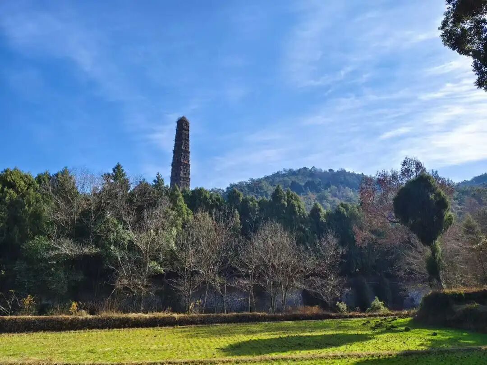

提婆，就是圣天，他是龙树的核心弟子，他是斯里兰卡人，如果我们追究佛教历史的话，你肯呢个会发现，提婆一开始去找龙树，是去找茬的，是去踢场子的。他当时学的是小乘佛教，他去见龙树，就是准备：你是大乘，我是小乘，我要给你找茬的。最后是被龙树折服的，折服了以后，学得很好，然后他就用自己所学的……又去找别人的茬了。（中观的初代目、二代目都有点闹啊……）

那个时候龙树说对提婆说，“南方有一个国家，那个皇帝好像对佛教不客气，你去把它搞定……”，然后他就去，搞定了。是跟人家辩论，一般来说是输的人要自杀，提婆说，不用你们自杀，你们都剃头。所以这个提婆就在王宫里面，跟那个国家的所有的外道头子，只要敢下场、敢跟他辩论的人，都辩论，（外道）就都输了。他两头堵，（外道）都输了。输了以后，这批人就剃了头，都穿上了出家的衣服。但可能提婆的政治智慧还是不够。虽然表面上这些手下败将他们出家了，但实际上他们不是真正想出家的。

有一次提婆在树林里面一个人在修行的时候，他的一个徒弟就出来了，拿出一把刀。“当年你用空刀来破我，今天我用真刀来杀你”，把他捅了。然后提婆说，到底是菩萨，大境界。如果是我的话，肯定是一掌拼着最后一口气，肯定啪的一掌，把他拍飞出去。是吧？但是菩萨和我们的想法是不一样的，他被捅了一刀，说：“你快走，我徒弟要来了……”有一种说法，说这个杀手最后他还继承了提婆的衣钵。好人啊！我的修行不够，菩萨就是和我们不一样啊。如果是我的话，我肯定是我一掌把他打出去，然后我跟他双双下地狱了（笑）。

后来提婆的弟子赶过来，提婆为了放他凶手逃走时间长一点，说：“你们不要追，我现在有最后的教授给你们……”，就讲了那个《百字论》，然后大家不追了……

不知道有没有人这样问，“师父，我们谁是你的最终的弟子？谁接你的庙？你的银行卡在哪里？”真有这样的徒弟，我还认识，他师父生病的时候到师父床前，“师父，你的银行卡在哪里？”师父气死了，当天马上打电话给上海的一个弟子，“你来接我吧”。把师父接到了南京去看病。你们不要这样玩，这个太丢人了。

所以中观派早期，你看就是得罪人太多。所以那个时候我在某地讲中观的时候，后来有些弟子就说，师父我们多讲唯识，意思就是我们……还想多活几年。

