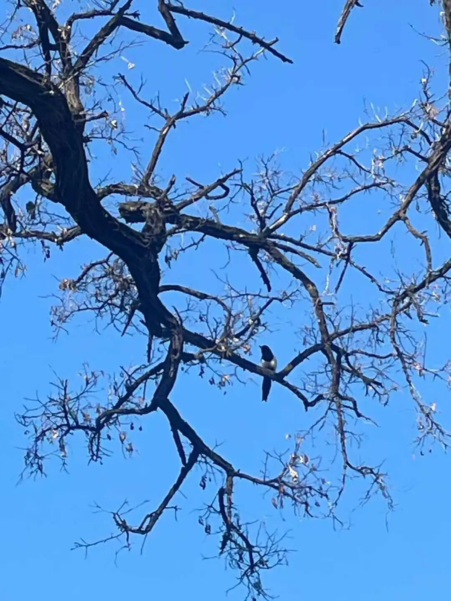

【问：这个辩论的传统是咋来的？】

他们历史上就这样了。印度的历史，首先我们知道它有四大种姓，是吧？种姓当中有婆罗门、刹帝利、吠陀、首陀罗等等，他们的这些高级的婆罗门地位哪里来？先到外面去学习，学好了回来，也是跟这些婆罗门（and寺院）辩论，辩论了以后他就掌握这些寺院了，或者被领主赐了土地……他就又相当于变成新地主、新势力了。有了地，然后有了老婆，再把孩子再培养成有学问的……但从此他也要面对新新人类的挑战，输了也一样，连孩子带老婆都要被人带走了。

你看佛经里面是很有很多类似的故事，你们看《阿含经》等等佛经故事，有很多类似的故事的。举个例子，最有名的故事就是什么，108个头的摩羯陀鱼，还记得吧？他爹就是一个婆罗门，学完以后到处走……找当地的国王，实际上也就是相当于乡长、镇长、领主，你不要以为印度的国王有多厉害，也就是个镇长。……这个年轻的婆罗门，他先找到了一个乡长、街道办主任，就找来老一辈的婆罗门地主来和他辩论，老婆罗门输了。然后，这个毕竟是个王，就很高兴，赐他一块地，于是年轻的婆罗门就住下来了……就娶妻生子，然后婆罗门很年轻就死了。

那个时候出现了佛教，有佛、有罗汉、有僧团。之前那个婆罗门的老婆就跟他们的儿子说，“孩子，你要好好学习，要回复你爹当年的荣耀！……”他儿子说什么呢？说，“妈，我的水平跟那些和尚比，实在比不了。”他妈说：“你比不了，你这样，你到和尚的那个圈子里面，你去学他们的东西。”他们婆罗门是这样，其实我们佛教也是这样的，清辨、法称都曾经在外道圈子里面混过，为什么呢？他出来一个新的外道，他要去了解他的教义，混过以后出来。你看他们都是辩论，辩论强手就是互相都有卧底的。

所以商羯罗在宗教圈里面有一种说法，说他实际上是佛教徒。就商羯罗对佛教，对中观唯识很了解的样子来看，他说不定在我们里面卧过底的，我们清辨、法称也在外道里面卧底过，新的外道出现了，不知道他在说什么，你怎么去辩论呢？也去卧底的。

然后他妈就说，“那你辩不过他们，这样，你就去他们的佛教里面去卧底，你去学他们的东西……”然后他儿子（劫比罗摩那婆）就去出家了，去卧底……卧底一段时间又回来。他妈说：“你学完了吗？”儿子说：“我学完了。”“那你再去跟那些和尚辩论。”儿子说：“妈，我还是辩不过他们，他们水平太高了。”那他妈就说：“那你就不要跟他们辩，他们是无诤的。你跟他们辩的时候，你只管骂猪头、羊头、象头、狗头。那些都是罗汉，他们不会跟你辩的，他们会走的。然后周围的人就认为你赢了。”

儿子就听他妈的话，就跟这些佛教的罗汉辩论，辩的时候也不争辩，也不直接辩，直接骂：猪头、羊头、狗头、鸡头等等，那些罗汉也不管他了就走了。

然后，广大的无知群众认为是他厉害，是吧？……后来因为这个事情，他死了以后，就投生为一百零八个头的摩羯陀鱼，大鱼长了一百多个头。

然后释迦牟尼佛敲他的头，问怎么回事？他用人话说：“long long ago……”就讲了这个故事。

如果我们把这个事情把它还原为历史的事实，就可以知道，当年印度的现实的宗教环境。这个就是当年的印度的传统，这种故事在《阿含经》里面很多，我们可以把它还原为当时的社会历史。

中国因为没有这个压力，所以和尚都不背书的，因为没实际社会需求，是吧。如果中国当年也是跟印度这样有压力的话，那估计也一样一定要小和尚们都背书的。所以，在印度佛教才会出现大量的阿毗达类的著作，而且不断地在更新。为什么？它要出2.0版，3.0版，要应付一些新的思潮，比如说现在出现了数论派和胜论派，他们的观点当中出现了比如地、水、火、风、空、时、方、我、意，他的观点有了，如果你的《××阿毗达磨》当中还没有对时、方、我、意进行回应，那别人来跟你辩，那对中小寺院中等学僧不就是得输吗？所以不断得有新的阿毗达摩出现……

