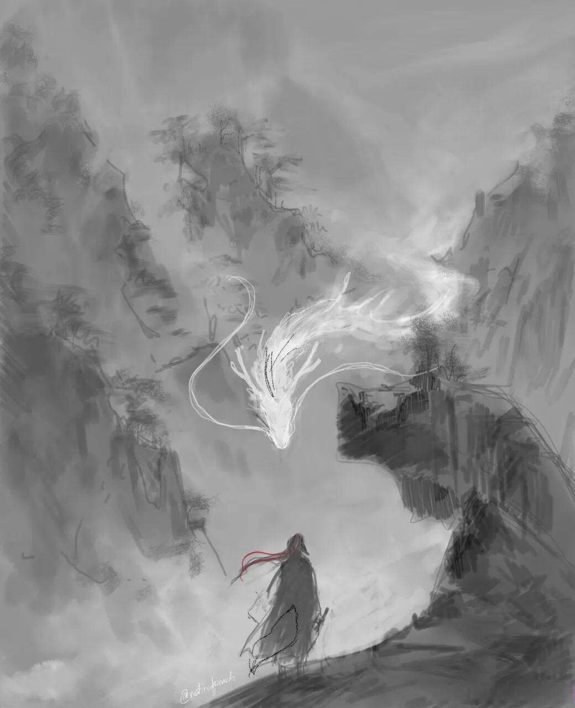

我们这种课还是能听的，是吧？如果我们真的玩“一根筋、两头堵”了，那我的课还没讲完，你就给我捅上来了。所以……看看实在不行，这种中观课就可以更虚拟一些，放到网上讲，至少生命……安全一点。

给大家讲佛教史、普及一下中观的史前史还是重要的。我们现在讲到的是《中观论》的来历，还没完全讲完，接下去还要讲《龙树六论》了。龙树所有的作品中，以《中论》为它的核心。

龙树如果我们比喻的话，真的像令狐冲，他那个剑法非常地的潇洒。你来什么？我就是这一剑过去了，我每一下都戳在你想不到的地方。只要你立的是“有自性”的宗，那你一定有破绽，而且破绽会很多，越来越多，我只要任何一个地方戳过去就可以了。这个是龙树《中论》……

后面的这些《中论》疏，比如说月称的《中论》疏，月称已经很厉害了，月称也把这本书（《中论》）翻透了。但是月称的做法，就觉得像什么呢？他把独孤九剑变成剑法了，就是他把龙树在那里挥洒的剑法，他把它录下来了，然后把它录下来，就变成一套一套的剑法再练。你看月称的这些套路，你发现就是他是《中论》的剑法，他是《中论》的剑法，但感觉它是有痕迹的剑法，你可以说这个是《中论》第一品的剑法，这个即使他在《中论》其他地方，用了《中论》的第一品的剑法，但你很明显你可以看出这是《中论》第一品的剑法……月称已经很厉害了，他把《中论》也融会贯通了，但是他的剑法的相对于龙树似乎还是有迹可寻。龙树是随手挥洒就是深妙剑法，行云流水，很好看……月称感觉还有套路，龙树这个属于“羚羊挂角无踪迹”……

禅宗里面有个比方，说这个时候就像你张着一个嘴，你想咬，对方是一个铁牛，你没有下口处。龙树这个剑法太好了，大家学不会怎么办呢？整理一套中观剑法学学。所以月称的东西我们还有套路可以学，虽然有点难，但是要有一些套路可学。而且月称这些剑法套路，可能还需要你之前学过一点因明什么的，就是你得先学过冲拳、横拳、摆拳，力量和速度，需要这些武术基础。

