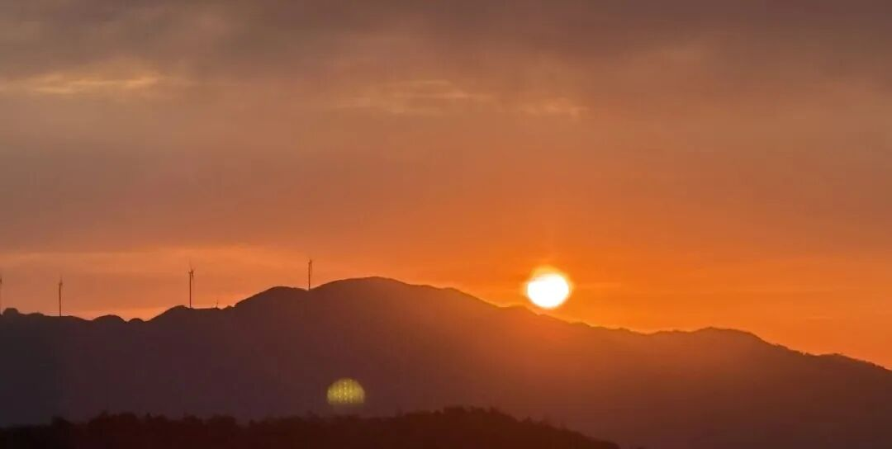

《中论》的重要注释本，目前因为最近翻译、出版速率的增加，现在我们看到的参考书是越来越多了，前面说过了，新译的《般若灯论（释）》《佛护释》《显句论》《正理海》都加入了新的参考书的行列，当然一般的俗讲我们就不计算了。

那么接下去讲到哪里了？龙树的作品和注解……

后来龙树就南方，在印度的南方一带，有一个石窟，现在叫龙树山的。那个地方我没去过，但是我师父他们去过，说是可能离孟买比较近，在那个附近，龙树山。

据冯友兰的说法，那个石窟面前他们觉得很震撼。因为我们知道

有一个文化现象，就是印度人是没有时间观念的。有一个很著名的一个故事，说是日本的外交官约了印度的外交官在什么地方见面。日本人以遵守时间著称，我们也能够理解，你们去日本就知道了，日本的地铁几点几分，那绝对是非常清楚的。我觉得我们上海的地铁，我们只知道等一会儿它就来了，绝对不会说几点几分有一班地铁。日本很多他很多人都是很精确地知道几点几分，他就赶几点几分的那班地铁。那次我去日本高野山的时候，我要下山的时候。高野山有个还俗的老人说，“你们要下山，你要去赶几点几分的地铁是吧？”我说是，他说“那你有点来不及了，这样，我开车送你下去……”就这样，他们对时间的要求在我们看来是有点苛刻了。

那么日本的外交官约了印度的外交官，（对时间相当敏感的）日本外交官先到了，而印度外交官……姗姗来迟……迟……迟迟……，日本的外交官等到花儿都谢了，印度人还没出发……最后日本的外交官都回去了，而印度的人还没到。日本方打电话批评那个印度外交官，印度人说，“你是觉得我让你浪费时间了吗？”他说：“你为什么不用那个时间来思考呢？”

这是一个著名的故事，可以窥见印度人是很没有时间概念的。他说：“你为什么不用这点时间来思考这个人生问题呢？”

【一下子拔得这么高？】

然后印度人造寺院跟我们造寺院不一样。所以印度人到了中国，达摩，菩提达摩到了中国，到了河南，看到洛阳的这个寺院，这个塔造得老高。他说，“这不是天堂吧？”看中国人造庙用木头和石头可以垒得老高的，“这不是天堂吗？”他如果穿越回来，他一定以为我们上海是天堂。

那么印度人造庙是怎么造的呢？它是一个石头山，然后就开始凿石窟。今天你们看石窟，以为它就是“石窟”，就是这个文物、艺术、文化的概念，但石窟的原来的意思它是寺院，就是把山给凿空了。本来就是一个山，把它挖空了，凿出房间，凿出来一个床，凿出来一个凳子、打坐的地方……全都是凿出来的。印度人把整个一个山都凿空了，凿成一个寺院……他们对时间真的是没有概念啊！中国人应该不会这么做。

他们那种造庙的方式，就传到中国。你看中国的石窟就在这个佛教的传播带上。看见没有？新疆，对吧？这个柯尔克孜石窟，到敦煌石窟，到麦积山石窟，再到中国的云冈石窟、龙门石窟等等。你看都是这样的。而且中国后来还发明了一些其他的。麦积山石窟还是石头的，那像敦煌石窟，他就发现单纯用凿石头太麻烦，那能不能糊一点泥上去，变成了泥塑，先把洞给搞出来，然后我糊点泥，那要比直接凿要方便多了。

他们造庙的方式和我们造庙的方式很不一样。你看中国的很多，现在实际上遍地都是石窟，江西可能石窟少一点，我们上次去衢州，浙江的衢州，衢州也有石窟，但是我没去成。下次我准备去了。很多地方都有石窟。杭州也有好几个石窟，对吧？杭州首先灵隐寺门前，前面就有石窟，还有他们周围有些山里面也有石窟。但是那些山，有些寺院是不会恢复了。有的寺院有白莲教背景，它对中国的佛教历史来说其实蛮重要的，因为他刻过藏经。但那个寺院一直说要恢复，一直没有恢复。说要恢复的原因是什么呢？因为那个寺院以前刻写过藏经，出过一个藏经。但是我说恢复可能性不大，因为它历史上是白莲教的大本营。我也没去过，反正是在杭州。

【栖霞山也有石窟】

对，南京栖霞山很明确的有石窟。

