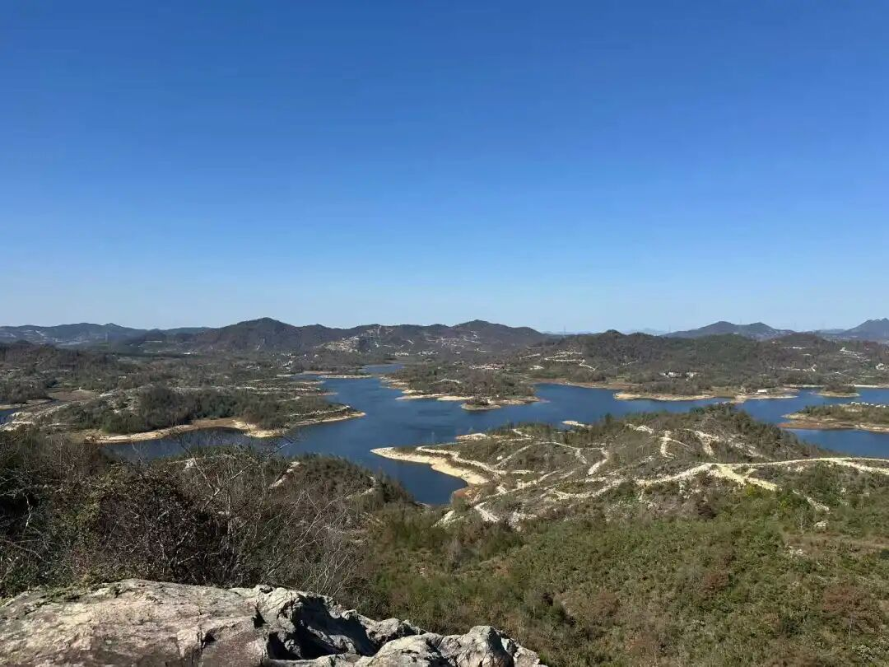

……大藏经……白莲教……

我们今天讲的元末的农民起义，其实很多都是邪教暴动，有白莲教的，也有摩尼教的……在学术系统当中，他们就很明确地说，这个就是白莲教，那个就是摩尼教等等。我说了两句，因为我们不是专门跟他们吵架的，但是作为宗教内部的人我也说两句，算是质难几个专门搞元史的专家。我说实际上如果你到民间你去走走看，你就知道了，民间他对自己的宗教身份不是很明确的。民间说你到底是白莲教，还是佛教，还是摩尼教、道教？他自己也搞不清楚。他认为这些“菩萨”“神仙”好像是一样的，没有那么明确的彼此的“差别见”。

刚刚才讲，Something is what IT is not another. “万法皆本然，终不为他者”，对吧。对民间的这些老太太们，她们没有这个概念，什么“万法皆本然，终不为他者”，“本然”“到底是什么”——这不是民间追求的，民间老太太们就信观音娘娘，佛教、道教在她们是没有区别的，连佛教、道教都没有区别，你让她去分别白莲教和摩尼教？分不出来的！所以你只可以泛泛地说，民间宗教（大串联），里面这部分有白莲教的成分，那部分有摩尼教成分，这部分是民间佛教背景，那部分是道教天师道的下沉……民间哪有什么精确的“我们是啥啥教”的自觉。

白莲教还有一个符号。你们看啊，朱元璋下面有很多大将，名字一看就是白莲教的。丁普郎，赵普胜，什么普什么，白莲教的法号经常是普什么，所以普A、普B(两位法师法名)很危险。他们的这个名字带“普”字。

所以你看明初的这些将领，这些名字一看就是一帮邪教徒。那个什么韩林儿，是吧？包括刘福通等等，都是白莲教。彭和尚，是不是？你看都有出家背景，是吧？还有我们的朱元璋，都有和尚背景。

我认为朱元璋当老大是有原因的。因为他以前是做和尚的，和尚到处跑，他知道哪条路可以通到哪里去。打仗早期这个很重要，哪里有粮，哪里有地主，哪条路可以攻下哪个关。他以前是到处跑的底层和尚，所以他做了皇帝以后，我们就倒霉了。他是底层的和尚，他看不起我们（精英佛教）。他说，“你们这种都是小乘，自己学的，闭关的，那种会超度的才是大乘，他们是度众生的……”。然后我们就被朱元璋给打压了，结果那些文盲和尚、江湖和尚被他扶持起来了。正统佛教在明朝受到极大的打压。

