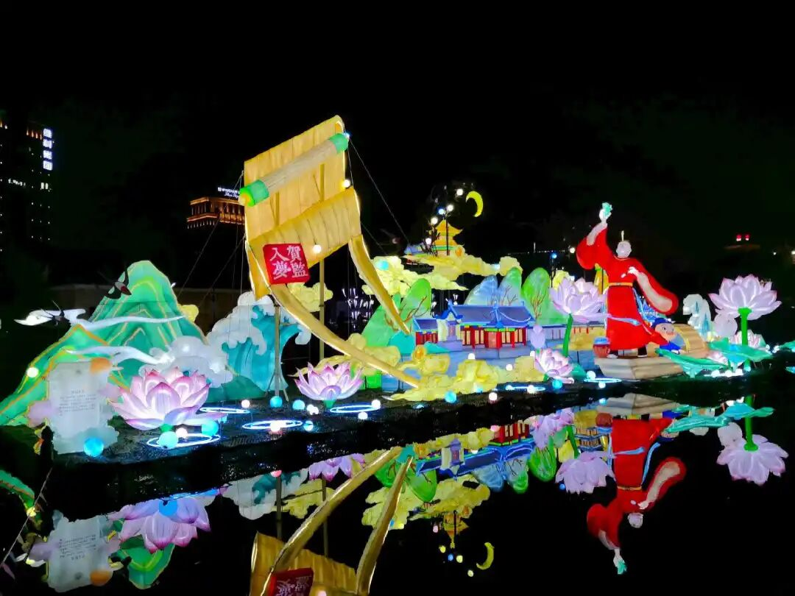

后期大家谁都这样讲（说自己是“应成”，代表自己最高），只有一个胆子大的，谁胆子大呢？就是××派。××派他就觉得不对，应成的说法不高，于是出现了一个名词叫“大中观”。“大中观”的意思就是“大”于中观，我们的这个中观比你们的中观要高，大于你们的中观。你仔细看，他实际上受到唯识的影响，你看它引用的经典很多都是唯识的经典。我说的“受到唯识影响”，也就是说它实际上并不是“纯”的唯识。他带着一种……他其实受到MZ影响，他把MZ的一些经典中的一些文字，做了自己的发挥，在我们看来就是没好好学习基础，乱搭配了，然后再用世亲、无著的一些文字来解释、来丰富。

实际上按照我们的说法，“大中观”走向了“如来藏——本觉思想”的观点，说“一切的功德我们这个内心里面全都有”！说是他某一次在打坐的时候，突然之间从心当中出现了很多佛菩萨。然后他说“原来一切法本自具足，一切都在我内心当中是有的”……然后又结合××里面的一些文字，由于他们没有扎实的文献基础，他就对这些文字做了一些自以为高超的解读，然后就解读为后来的所谓的“大中观”——“一切功德本自具足”，也就是所谓的“他空见”这个情况，“他空自不空”嘛。……关于这个“他空见”什么的，我们就不讲了。

……清辨对佛护而言，他是后学。传的说法是清辨、佛护、月称都直接是龙树的弟子。我们今天站在历史唯物主义的角度来看，这种可能性不大。在那啥传承表当中，月称是直接接龙树的，然后说龙树活了600年，说佛护、清辨、月称他们几个是师兄弟，实际上应该不是，月称和佛护之间大概差了两三代人，清辨则略晚于佛护而比月称要早。月称大约比玄奘法师晚一点点，比义净法师要早一点。

