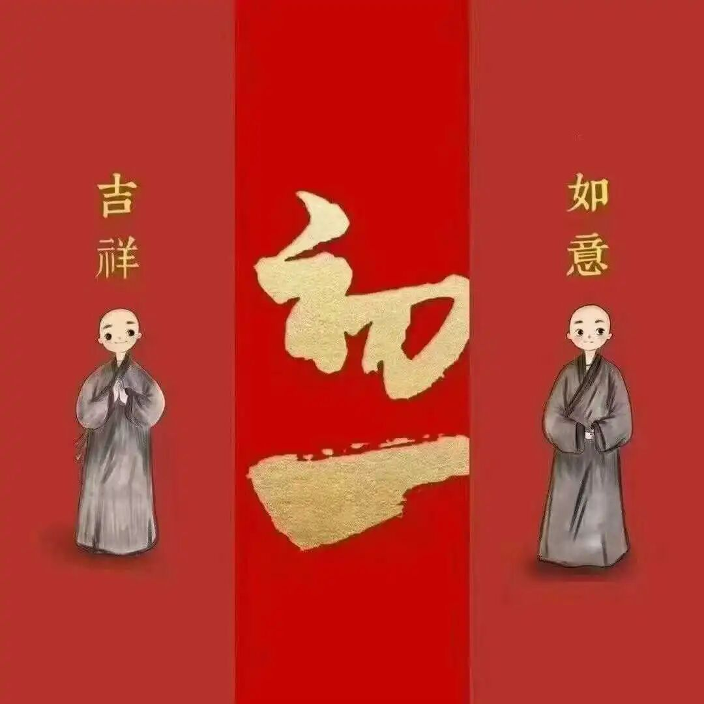

月称其实不仅批评了清辨，同时也大量地采用了清辨的一些观点。现在的教界，包括现在国际上的学界，由于因为是以月称的观点作为主流叙事的，所以对清辨好像有点关注度不足的样子，但实际上清辨的历史地位绝不亚于月称，他在“中观界”的历史地位，在很长的历史时间内都是绝对要超过月称的。今天月称之地位的确立和崛起，大部分要归功于宗大师，是因为宗大师给抉择、定调的。

某种角度上来说，在印度中观的后期，月称见其实并不是被重视的。其实后期的中观学派，自续派才是主流，也就是说，在大乘发展到的后期（九到十二世纪），中观和唯识又合流了——在清辨抉择以后两宗明确分流，到后期又合流了，就成为“中观自续顺瑜伽行派”了。自续顺瑜伽行派折中了唯识和中观的形而上学的理论，认为，在胜义谛的建立上中观是对的（即胜义无），在世俗谛上则把唯识全部拉进来了，这就成了“中观自续顺瑜伽行派”。

中观自续顺瑜伽行，有两个来源，一个是中观师方向的来源，一个是唯识师方面的来源，唯识的来源部分，还有跟一个东西有关，《现观庄严论》。《现观庄严论》属于弥勒学，这个系统往中观靠，就是中观自续顺瑜伽行派的一个来源……中观自续大致有两到三个来源：1、清辨、观誓；2、寂护、莲花戒；3、解脱军、狮子贤。其中前两个系统来自中观系，后一个系统原先属于弥勒学。

比如说我们讲师子贤、解脱军。一般说有两个解脱军。传统上来说，有圣解脱军和尊者解脱军。但是XF大师认为这两个应该是一个人。为什么说这两个是一个人呢？因为发现这两个人的《现观庄严论》的注解不重合。

比如说，署名圣解脱军的《现观庄严论》的注解和署名尊者解脱军的这“两个人”的《现观庄严论》不重合。好像明显是一个人的写的两个。所以合理的猜测是，“圣者解脱军”是证圣位以后的尊称，而署名“尊者解脱军”是还没有证得圣位，所以署名上，一个叫“尊者解脱军”，一个叫“圣解脱军”——这是一个合理的猜测。他们的后学叫师子贤，《现观庄严论》的教授是从他们这一支开始弘扬开的。

