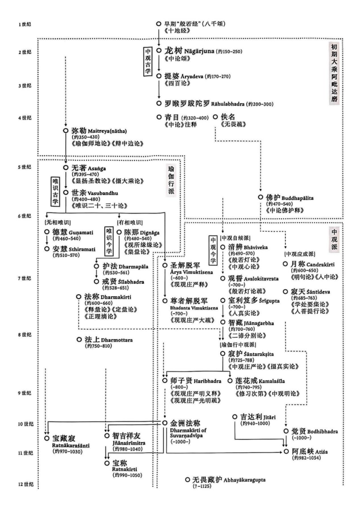

叶少勇老师的《佛护释》里面有一张表格，我待会儿回去拍一张给你们看啊。他有一个中观、唯识师在大概从2世纪开始到7、8世纪的一个年代表。到时候我拍一张给你们，可以看一看。

在印度大乘佛教的后期，中观和唯识合流，好像是一个主线，表现为在今天的这些梵文的作品当中，后期的大乘论典大量的是中观自续派，还出现了中观自续顺瑜伽行派。比如说，我们经常说莲花戒，还有他的师父寂护。目前我们说，寂护是中观自续顺瑜伽行派的开创者……因为他之前我们也找不到其他的代表人物、代表作品，所以就以寂护（静命）作为已知的中观自续顺瑜伽行派的开创者。

根本中观的开创者，龙树加上圣天。那么中观应成的开创者佛护、月称。中观自续的开创者清辨。中观自续顺瑜伽行派的开创者是寂护……清辨也可以称为是中观自续顺经部学派的开创者。但是此前不是今天的这个说法，这个说法实际上是宗大师最后抉择出来的。早期说清辨是中观顺经部的学派，然后把月称当作是中观顺有部学派的。我们现在觉得有部分道理。

传统的印度对中观师的分类还真不是完全没道理，看看今天的那啥的很多观点和风格，很多确实跟有部很接近……早期在印度的说法，清辨和月称，一个是中观顺经部的，一个是中观顺有部的，但这个说法现在已经不用了，现在说佛护、月称是中观应成派的开创者，中观自续的开创者、同时也是中观顺经部行的开创者，是清辨。中观自续顺瑜伽行派的开创者是寂护，莲花戒是寂护的弟子。

学者们有时候看书的时候都是泛泛地看过去，连写书都是随随便便的。莲花戒和莲花生是两个人。有一个人（不说名字了）写的叫《藏传因明史》，所有的地方他都把莲花戒写成莲花生。大哥，这是两个人啊。这两个人年代有点接近，名字也有点接近。但两个人的传记就完全不一样了。就望文生义，就跟什么青目就是清辨一样。

今天先到这里，有什么问题吗？给你们三分钟问题时间。

晚上讲得没有白天那么嗨，很有可能就是糖分没了。你看，我们错误都是别人的问题，是吧？在别人身上找错误，实在找不到了，在血糖上面找错误。

