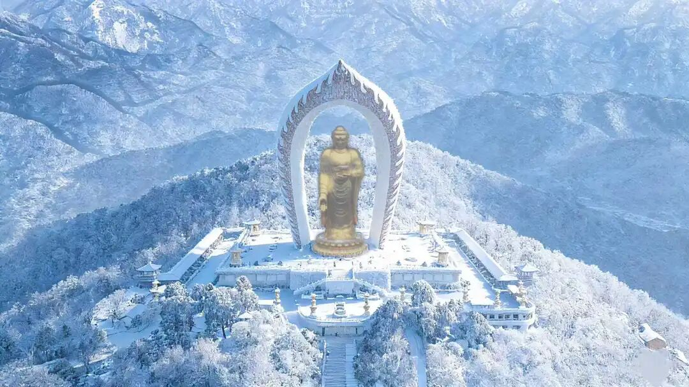
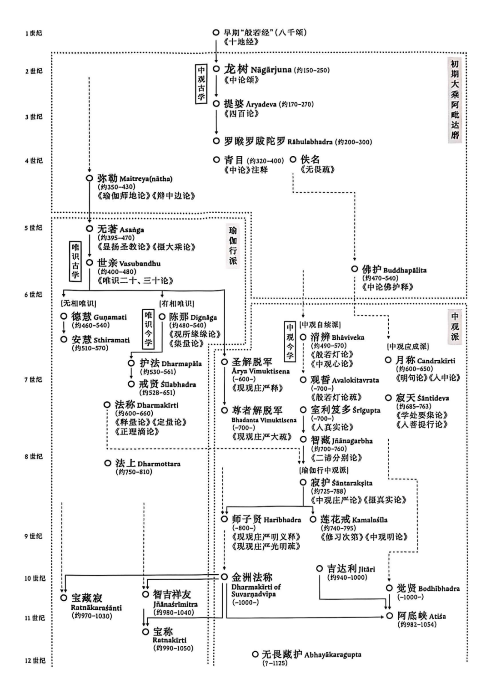

昨天讲了一点中观和《中论》的历史。

首先，昨天给了大家一个表格是吧？是叶老师做的一个大乘论师的一个表格，我们稍微在这里重复一下。

这张图的意思是，公元1世纪时，大概早期的《般若经》（《般若八千颂》）已经出现了，包括《十地经》（华严经·十地品）等。那就是说《般若经》、《华严经》等等这些开始出现了，包括《法华经》《维摩诘经》等等。接下来他说“中观古学”，按照昨天我们的说法，是我们说的“根本中观师”，和后来的他这里“中观今学”，就是“随行中观师”。

中观古学当中，龙树这个时代。现在国际学术界通行的认为他是在公元2世纪前后传统佛教的记载一般还得把他推到公元前后，因为按照“受记”龙树是在佛灭五百年“出世”的，而释迦佛的圆寂时间一般认为是在公元前486年，所以传统佛教界认为龙树出世应该在公元前后，但目前学术界的通说指向他活跃于公元2世纪前后。

那么，提婆比龙树大师稍晚一点点的，晚到什么时候呢？不是很精确的。现在我们这里是一种推论，既然他是龙树的弟子，那他应该晚个二三十年这样的样子。但我们都知道他寿命又不长，现在这个表也是大致推测在一个时间段。但是大家知道他跟龙树差不多时间，出生年代比龙树稍微晚一点点，但是很有可能他过世在龙树之前。这里说是270年，好像有点晚了，但大致差不多。

提婆的弟子实际上我们现在并不能精确的了解……罗睺罗跋陀罗是什么情况呢？在汉地的中观传记当中是有他的名字的。在中观的历史上，也有说《赞般若波罗蜜多偈》的作者就是他。那么罗睺罗跋陀罗还有一个颂子，在《顺中论》当中有。如果大家有兴趣的话，看一下《顺中论》，就是无著的。那里还引用了罗喉罗贤的一个颂子，那个颂子我忘了，其实《赞般若波罗蜜多偈》我也忘了，我只是看过几遍，写过几篇文章……

我把《顺中论》引罗睺罗的颂子找出来了，大家看一看——

“罗睺罗跋陀罗言：

一切见对治，如来说空是，

不爱空不着，着空空亦物。

不爱空不空，此二非不爱，

无能坏佛语，佛语处处遍。”

