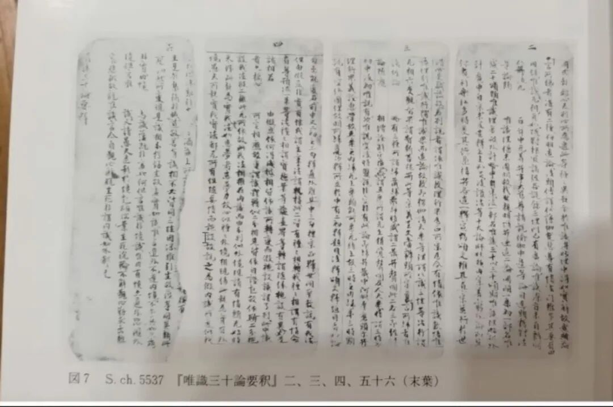

好，我们差不多开始了，现在呢，我们是讲到第三能变。

《唯识三十论》要释，这个敦煌本我没找到，但是我看到一个，我拿给大家看一下，这个是敦煌本《唯识三十论要释》的一部分，这个就有点有趣了。

我们来看一下，这个以现在来说，这个装桢不知道应该怎么算，它有点像梵箧装，但是它是等于是竖排的，你看它和我们看到的其他的这个敦煌本有点不一样，看见没有，大家现在看到我们照片了哈。

一个呢？这种的形式如果横过来就很容易理解是吧，就是接近于“梵箧装”的，但是他是这样竖过来写的，这个中间空白的地方，传统上应该是穿绳子的，后来变成一种“格式”，也不凿开，也不穿绳子，就留一个空白，再后来，空白的部分也不见了……

《三十颂要释》的这个空白，是准备要穿一根绳子的意思，早期是留两个空白，穿两根绳子……如果是横过来放的话，就算是标准的“梵箧装”了，就是早年印度的装帧形式，中国佛教早期也是这个形式，然后慢慢演变为卷轴装、龙鳞装、经折装、蝴蝶装、线装……今天南传和那啥还在用传统的梵箧装（稍有变化）……

明末以来，教界很多人把“经折装”叫“梵箧装”，这是完全错误的，主要是因为明末某位大师（我就不说名字了）搞错了，接下来大家一起错……连今天很多印《大藏经》的都搞错，很难改了都，每次有机会我都要强调一下。梵箧装那是一张一张、一页一页的，经折装那是一张折成好几页的……。

关于佛教经书装帧的演变，我发过公众号做过简单介绍，到时候找一下再发出来大家看看。其实很多东西大家真正一上手就都知道了，有机会我带大家上手，直接体验“梵箧装”“卷轴装”“经折装”“包背装”“方册装”（线装书）是啥样子的……我们做过一次展览，也讲过几次课的。有机会去博物馆看看也可以的……

这个《敦煌本<唯识三十颂要释>》的本子呢，如果一定要说的话也可以说是梵箧装的变型……大家看一下，这个就是我们现在讲课的这个敦煌本的样子

“**同；或執離心無別心所。為遮此等種種異執，令於唯識深妙理中得如實解，故造斯論……** ”（认图片文字）看见没有。

这个如果一定要定名字的话，也可以把它理解为变型的梵箧装、梵箧装的一种，也可以把它理解为就是梵箧装。

图片来自一日本书的图版部分，因为找到这个了我们就临时拿出来给大家看一下、见识一下。

