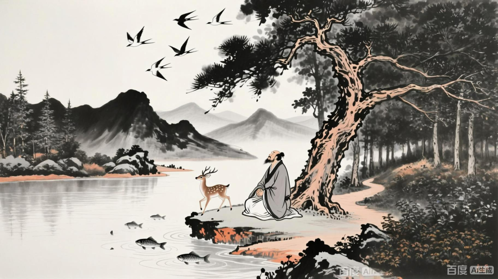

但是“本无”（性空）这个词幸运（有了“共鸣”）又不幸（南辕北辙）地撞上了中国的“本无”，导致南北朝时期绝大多数人对他（佛教的本无）理解错误，造成了对大乘般若学的理解错误，所以就出现了般若学的“本无宗”——“本无学派”。

南北朝时期，本无宗、本无学派有两个，本无师（道安）和本无异师（竺法汰）。

大乘佛教般若学，在南北朝时期发展出了“六家七宗”。其中有本无宗、本无异宗（这两宗算一家）、本无宗、识含宗、即色宗、幻化宗、缘会宗。这六家七宗都是对《般若经》里空有思想的中国化总结，都抓住了《般若经》的部分文字，并给予了各自的解读，但其中大部分人物都活跃在罗什以前，没有得到正统印度佛教大乘中观学的严格教学、训练，所以都属于各执一词的中国中观学的先驱学派……所以在罗什“进场”后被正统中观学作为纠偏对象。

其中有“心无派”，他们主张——“汝但无心于万物，万物未尝无”（你只要不被外界所束缚，他们存在与否又何妨呢？），这个思想（其实我更认为是一种“态度”）是中国从南北朝那个时期一直到今天，就是中国绝大部分人对“空”的“直观”理解，就是——“不要执着”！它更接近是一个（对事的）“态度”，而不是一套形而上学体系——中国人好像习惯于把高高在上的“形而上学”请下来谈具体的“伦理实践”。

中国人绝大部分人对“空”的理解是办事“态度”——“不要当回事，事情是可以过去的”，“只要你心不要去被万物所系缚，那何妨万物的存在”。你们想想，你们周围听到的这个所谓的“空”的解释，绝大部分法师基本上就是这么说的。这是般若六家七宗当中，档次最低的一个，确实大众普遍接受的中国化、玄学化（道家化）的“空观”。早期的中国般若佛教是主动参与讨论玄学重要话题——“什么是‘逍遥游’？”的。“汝但无心于万物，万物未尝无”，正是一种“逍遥游”……

据《世说新语·假谲》，支愍度与一“伧道人”（北方僧人）共谋过江，因担心用旧义（传统义理）在江东难以谋生，便共同创立“心无义”以适应南方环境。据《高僧传·竺法汰传》，道恒是东晋时期僧人，执守心无义，在荆土地区活动。

《世说新语·假谲》：

“**愍度道人始欲过江，与一伧道人为侣，谋曰：‘用旧义往江东，恐不办得食。’便共立心无义。既而此道人不成渡，愍度果讲义积年。后有伧人来，先道人寄语云：‘为我致意愍度，无义那可立？治此计，权救饥尔，无为遂负如来也。** ”

《世说新语》的故事未必为真，心无宗的“汝但无心于万物，万物未尝无”，其实就是《庄子》的“物物而不物于物”（善用外物而不被外物所束缚）的转述表达。‌

《世说新语》认为“心无说”是六家七宗里最低的那种，是为了谋生、“救饥”的“不了义说”，但这种“空观”确是大部分中国人对般若空观理解的上限了。

