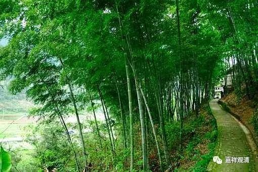

**《中论》“佛能灭有无”之“迦旃延经”**

续昨

《中论》说的《化迦旃延经》，《杂阿含》为陀迦旃延，《大智度论》说“删陀迦旃延”，此二应为一人。《南传相应部》此经则直云“尊者迦旃延”。如云：

“……尔时，尊者迦旃延來詣世尊處。诣已，礼拜世尊，坐于一面。

坐于一面之尊者迦旃延，白世尊曰：‘大德!所谓正见、正见，大德!正见者何耶?’

‘迦旃延!此世间多依止于有与无之两[极端]。’

迦旃延!依正慧以如实观世间之集者、则此世间为非无者。迦旃延!依正慧以如实观世间之灭者，则此世间为非有者。

迦旃延!此世间多为方便所囚、计、取着。圣弟子计使、取着于此心之依处，不囚于‘予是我，’无著、无住，苦生则见生，苦灭则见灭，不惑不疑，无缘他事，是彼智生。迦旃延!如是乃正见。

迦旃延!说‘一切为有，’此乃一极端。说‘一切为无，’此乃第二极端。

迦旃延!如来离此等之两端，而依中道说法……”

查《南传大藏经》，此处迦旃延，有作kaccānagotto及kaccāna，而非mahākaccAna（摩诃迦旃延）。

Kaccānagotto，kaccāna，即迦旃延；巴利文gotto，梵语作gotra，汉译“迦求陀”，《十诵律》之“宾头罗尊者取钵事”中有“迦求陀迦旃延”，《四分律》“钵事”做“波瞿迦旃延”，《南传律·犍度》做“迦求陀栴延”。此之迦求陀迦旃延、波瞿迦旃延、迦求陀栴延应是一人。《翻梵语》谓：“‘迦求陀迦旃延’：译曰：迦求陀者，领；迦旃延者，姓)”。

又，巴利文gotto，即种姓、姓，则kaccānagotto即“姓迦旃延者”，略即迦旃延。故南传有谓此处之kaccānagotto及kaccāna即mahākaccAna（摩诃迦旃延）

未完待续……

探案进行时……

