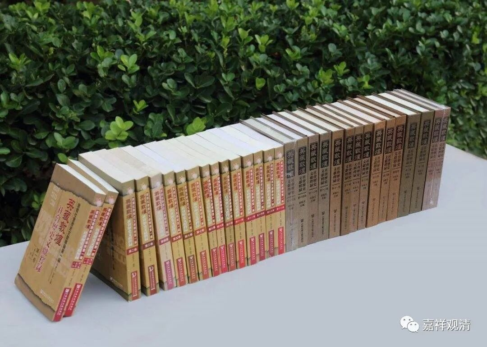
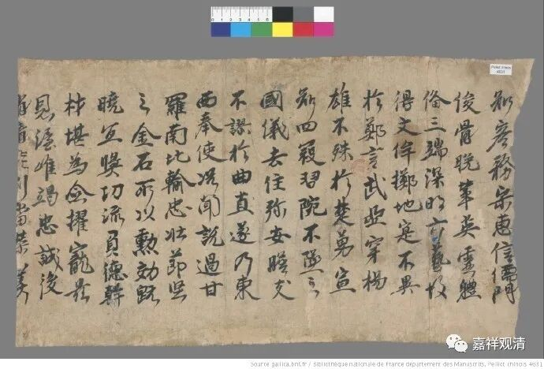

Cbeta收入了敦煌本《大乘中宗見解》。今天正巧要用到，看了一下（尚未核对敦煌本原帖），有几处或许可以稍微订正的。（标点符号不改了。）

一

**“問、何者四無量心。**

**答、慈悲喜捨名四無量心。**

**問、何者〔四無量心。〕**

**〔答〕慈能乘。悲能拔苦。慶彼得樂名之為喜。平等持心名之為捨。”**

清案：

“慈能乘”，当作“慈能与乐”，“与乐”二字连写，颇类“乘”字。但佛典“慈”即“能与乐”为一向之通说。

**二**

** “答、無明行識名名色六入觸受愛取有生老死、此是順〔觀〕。**

**〔問〕何者逆觀。**

**答、〔生〕死眾生、生緣有、有緣〔取〕、取〔緣〕愛、愛緣受、受緣觸、觸緣六入、〔六〕入緣名色、名色緣識、識緣行、行〔緣〕無明、々々〔緣〕一念不覺。”**

清案：

“名名色”，初“名”当衍。

“〔生〕死眾生”，当作“死缘生”。“缘”“眾”形近。

“々々”，即前之“无明”的简写。

**三**

**“言宗中（中宗）者、遠離(二七)捐咸（損減）及以增益二邊諦故、於世諦門中觀緣生內外諸如引（?）有、故不謗世法一向是无。”**

** **

清案：

“如引（?）有”，当释读为“如幻有”，“幻”“引”形近。

敦煌文献，图文无关

**四**

又，此篇之“中宗”，即“中观宗”，印藏皆谓“中宗”。

敦煌【斯二九四四背】《融禅师定后吟》之前有《大乘中宗见解义别行本》。按，牛头法融为三论系禅师，此件（《融禅师定后吟》）前件为“中观见解”，或者暗示此“融禅师”即牛头法融。【伯二二九七】首题《定后吟 命禅师作》，此“命禅师”不知为谁。法融前后似乎尚不知有“命禅师”者。

找机会直接核对一下敦煌图片。

