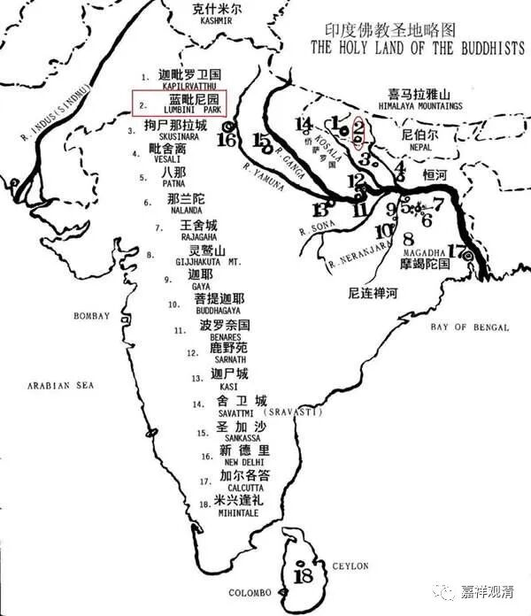

**《百论》游义·难陀故事**

义释：

此处说“持戒求乐报……如覆相”，“覆”的意思是把不好的东西掩盖起来。戒律，原意是别别解脱、殊胜解脱——用此“殊胜解脱”之法来掩盖“贪求”的目的，所以叫做“覆”相。

此处“为淫欲故”是举一个特殊的例子，并非只有为贪淫的目的才是不净持戒。

同样，“**乐报有二种：一者生天，二者人中富贵**”也仅是举例，而不是看作是分类。《大智度论》里有沙弥持戒求后世为畜生道，遂投生作龙王的故事。

吉藏《百论疏》说前面布施分为现生与后世，这种分类在持戒这里也可以通用。

这里举难陀的故事，来解释为“贪淫、求乐报而持戒”的“覆相”。

难陀等初出家便身相庄严，净饭王赞叹为“如凤集须弥顶”（此前净饭王形容释迦佛早期徒众为“似乌鸦倨山巅”），而此时难陀的内心犹贪恋其妻——外现庄严而内心不净，此即前说之“覆相”。

难陀事出《出曜经》：

难陀是释迦佛堂弟，仪表堂堂，王族贵胄；有妻孙陀罗难陀，世称美女，难陀甚为贪恋。一次，释迦佛与阿难上门乞食……难陀取钵盛饭，而佛与阿难转身便回……难陀追至山林，竟然被释迦佛安排剃度了……难陀贪恋其妻，数次欲逃回而不得。佛带他游历天宫，见众天女处于空闲宫殿。释迦佛问难陀：“这些天女和你的孙陀罗难陀，哪个漂亮？”难陀回答：“和她们比起来，孙陀罗就像只扒了皮的母猴”……难陀问天女：“为何处于空旷之宫殿？”天女回答说：“现有难陀比丘出家，来世即生此处为天主，我等奉侍之”。难陀大喜，遂不再贪恋孙陀罗难陀，专为求生天与天女游戏而精勤持戒……释迦佛再令阿难以好友身份前去规劝训诫。阿难即对难陀说此偈：

“如羝羊相触，将前而更却；

汝为欲持戒，其事亦如是。

身虽能持戒，心为欲所牵，

斯业不清净，何用是戒为？”

难陀便幡然醒悟，专求解脱，不久获证阿罗汉果。

吉藏《百论疏》说难陀出家事发生在“祇洹精舍”，这是地理概念有误。此时难陀家在迦毗罗卫国（上图1），祇洹精舍在舍卫城城郊（上图14），两处相距尚远。应该只能泛泛地说在迦毗罗卫城郊之林间，僧众聚集之处。

