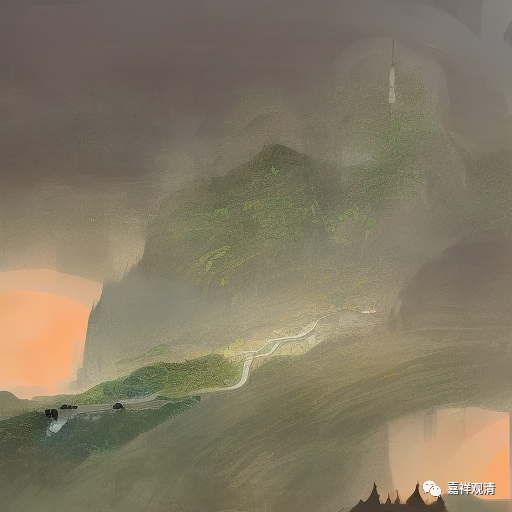

**《宗义略讲》001·023**

空洞的定义背后，就需要其他的字面上没有的内容在后面撑着，而这个字面上没有的内容呢，是可以无限展开、是非常多的，后面有非常非常多的观点，有很多是有特色的观点，比如说你完全可以找到几个说法，是只有他承认其他不承认的，你可以依据这些再做定义，这样可以吗？可以！所以从这个角度，定义不是只有一个……我们自己知道定义不可能只有一个，问题是如果是多个定义就无法辩论，所以为了要辩论啊，所以先限定只有一个……

那么大乘和小乘，实际上小乘是不是不承认法无我呢，这就是刚才的黑天鹅事件了，这种标志性的黑天鹅在汉地是飞出来的，汉地的《成实论》当中，作为经部的论典，它是承认法无我的，如果按照宗义书定义的话，就出现了一个经部的黑天鹅，那就变成他到底算大乘，算小乘。所以呢，可以说宗义里面这个“经部”概念定义的核心点，没找精确，不是很精确……

但也没关系，反正定义是不断地在演化，不断地在找到黑天鹅以后，不断地进化。我们数学也好，我们物理学也好，就是这样进步的吗？有一个小概率事件不能被理论所解释，小概率事件不断不断积累，为了解释这个小概率事件出现了一个新的理论，然后融到前面一个理论当中去，不就是这样吗。佛教其实也是一样，对吧。

既然你是讲法无我的（削成跟自己一样的脚，穿在自己鞋子里面），假如你是讲法无我的，那你就不是小乘，假如你是小乘，你就不可以讲法无我！假如这个经部（成实宗）的人碰到一个二三流的学者，这个二三流的学者会如何对待他呢？会用他的教材（教材说经部不许可“法无我”）来限制你：第一，你想做经部就必须放弃“法无我”（因为教材里说了经部不认“法无我”），第二，要么你放弃经部师的身份而作大乘人（因为经部不说“法无我”，说法无我的是大乘人）。那么成实师是不鸟这个学者的——我自己是经部师的身份还需要你来认定、你来教我怎么做？！

