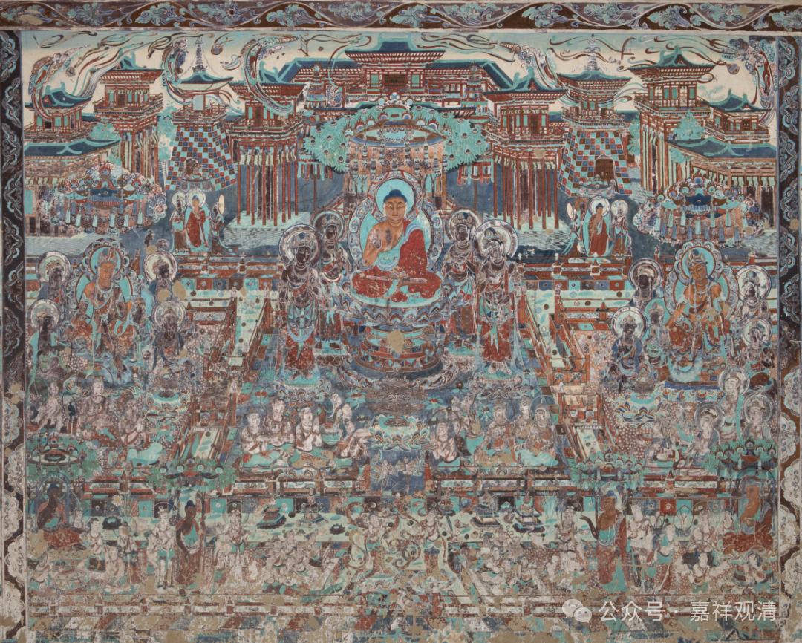

**关于“不退菩萨”******

大乘经典中经常出现“不退菩萨”这一名词，但“菩萨”“不退”和真正意义上的“不退菩萨”不完全是一个意思，我们来看——

先给结论，“菩萨”而说名“不退”的，有七：

**一、“信”不退：**

菩萨“十信”位之第六信“不退信”。

菩萨十信位：1、信心；2、念心；3、精进心；4、慧心；5、定心；6、不退心；7、护法心；8、回向心；9、戒心；10、愿心。

**二、“住”不退：**

菩萨“十住”位第七住之“不退住”。

十住：1、发心住；2、治地住；3、修行住；4、生贵住；5、方便具足住；6、正心住；7、不退住；8、童真住；9、法王子住；10、灌顶住。

**三、见道“证”不退：**

初地以上大乘圣者，不退为凡夫，名“证不退”。

**四、八地“行”不退：**

八地以上“三清净地”菩萨，智慧、福德皆已超出二乘无学，以“智不住诸有，悲不入涅槃”，广行利生事业，不退转为小乘，故名“行不退”。

**五、“烦恼”不退；**

阿罗汉回小向大，最初发心时虽然仍是“大乘凡夫”，但他在证二乘无学果位的时候已经断尽烦恼障，此烦恼已无余永断，故名“烦恼不退”。（亦通大乘圣者，所断烦恼不再生起，亦名“烦恼不退”。）

**六、“缘缺”不退：**

如生极乐净土，诸上善人会集，环境殊胜，无有退堕之缘，故名“缘缺不退”。此位在资粮道，甚至有说可以在资粮道以前。

**七、“精进”不退：**

有加行道菩萨，以精进力故，不断增上，无有退转，此名“精进不退”。

而作为专有名词的“不退菩萨”则指上述之第四——“行不退”，即：八地以上的三清净地菩萨被称为“不退菩萨”。

如《成唯识论述记》云：

“**由是不退總有四種****：******

**一****、****信不退****，****即****‘****十信****’****第六心****；******

**二****、****證不退****，****入地已往****；******

**三****、****行不退****，****八地以上****；******

**四****、****煩惱不退****，****謂無漏道所斷煩惱一切聖者****。******

**今說迴心名不退者****，****即第四不退。以得證淨故****，****亦名信不退****，****然未至彼位****。**

**若****‘****十住****’****第七心等亦名****‘****住不退****’，****即應有五。****”**

