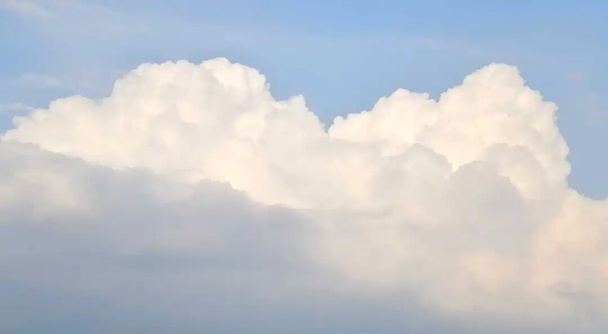

“2、**又，不動地以上菩薩，一切煩惱永不行故，法駛流中任運轉故，能諸行中起諸行故，剎那剎那轉增益故。此位方名****‘****不退菩萨****’****，而緣此識我見、愛等不復執藏為自內我，此位亦得名****‘****阿羅漢****’****，由斯永失****‘****阿賴耶****’****名。**”

“以上”的“以”，《要释》、《大正藏》之《成唯识论》作“已”，宋思溪藏、元普宁藏、明嘉兴藏和日本的宫内本作“以”。确实用“以”好一点。

又，“不退菩萨”，《要释》作“不退菩提”，《成唯识论》作“不退菩萨”。

这是《成唯识论》里对“阿罗汉”的第二种解释，这个第二个说法很牵强，对是对的，也没有错，但是很牵强，需要让中观来帮他解释，比他这个解释要更好，他现在用的这个解释其实更纠结，更麻烦啊。

所以你看这个唯识要讲的好，还需要我们来帮他们一把，他这个说法其实有点问题的，我们来看啊，等我我们讲完这个，我来帮他建立一个，比他建立的好，比他这个说法要好多了，又简单又好啊……哈哈，这个我们别的本事没有啊，先吹牛先吹上啊。

好，我们来看啊，“又，不动地以上”，“不动地”就是第八地，第八地以上菩萨，“一切烦恼永不现行”，他说是八地以上的菩萨烦恼“永不现行”，“现行”简单说就是“直接表现”，用熊十力的话来说就是“呈现”。

在这里面为什么要讲“永不现行”呢？你不要以为它在这里面“永不现行”是“全部断除”的意思，它的意思实际上是没有根本断除啊。为什么呢？在唯识和中观自续里面，这个记住啊，应成不是这么认可的，在唯识和中观自续里面，十地菩萨每一地都要断一分烦恼障和一分所知障（有的说特别的地有断两分的，这里不细讲），所以对唯识而言，他有一个情况，他认为在不动地以上的八、九、十，三地的时候，还有一分烦恼没有断的，这个是什么呢？它的“烦恼是不现行的”、“烦恼的种子”是没有断的，这些“烦恼的种子”是在八、九、十这三地断的，它的原文的意思就是在这个十地当中，每一地都要断一品的烦恼障和所知障，所以对这里的唯识而言，他认为第八不动地以上的菩萨是有烦恼的，但是呢他的烦恼“不现行”，就是不直接表现说是“不现行”……反正你们知道意思，领会精神，不现行就是不直接表现，不（会）在当前表现，他是以“含藏位”的样子藏在那里。所以你们不要以为简单的一看到有“不现行”就没有了啊，不是啊，它的意思是烦恼的种子还有，但八、九、十这三地永远不会再表现出来。

