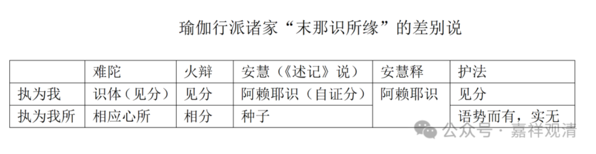

**“****不緣相分****，”**谁说“缘相分”呢？火辩，火辩说这个“第七识缘第八识的见分为我”，不错，我同意——火遍说这个（**緣藏識見分為我****）**我跟你一样，第七识缘第八识的见分为我，但是，它不是“但缘”……火辩说，同时，第七识还要缘第八识的相分为‘我所’。

火辩也是《唯识三十论》的注释的十大家之一。但是护法不同意这个说法，护法说第七识不缘相分，也没有“执为我所”的部分。护法似乎对我所执萨迦耶见是视而不见的，我不记得他在任何地方提到过我所执萨迦耶见的概念，当然也许是我记忆的问题。

然后呢，“**识中种子**”这一句是说安慧的。《成唯识论述记》说安慧认为第七识缘第八识当中的种子执为我所；因为安慧是一分家，所以，安慧是许第七识缘第八识（自证分）为我。安慧的《唯识三十论释》现存，有四五个新译本，检查发现，安慧的《三十论释》仅仅泛泛地说“执阿赖耶识为我、我所”，并没有提到执种子为我所。

接下来讲“**相应法**”，这句指向二分家难陀论师。难陀好像一向是《成唯识论》里面批评的对象啊，难陀说什么呢？难陀说“第七识执第八识的见分为我，一样”，同时，“第七识执第八识的相应法（触、作意、受、想、思）”为我所。

我们可以发现，火辩、难陀、安慧论师其实都在设计解决“我所执萨迦耶见”的问题……

但是护法试图无视“我所执萨迦耶见”的问题，他不认同三人对我所执萨迦耶见对象的建立，所以他说“**不****缘相****分**（执为我所）”；不缘“識中種子（执为我所）”，“不缘相应法（执为我所）”，不缘这些法（第八识的相分、种子、相应法）而执为我所。

这个听懂了吗？能够不晕在这里面，不晕已经很好了啊。

我们来看啊。给大家画个表格啊。

那么，为什么其他的论师要有“执我、我所”的说法呢？是因为这样，因为在《瑜伽师地论》的第六十三卷当中，他有这样的文字叫**“末那名意，于一切时，执我、我所，及我慢等，思量为性。”**那么，这些论师的意思是，既然《瑜伽师地论》里面说了，“末那识于一切时执我、我所”，那么诸家就说，有“我执萨迦耶见”，也有“我所执萨迦耶见”，这时候，护法就是一个异类了——只有护法说，没有“我所执萨迦耶见”……

